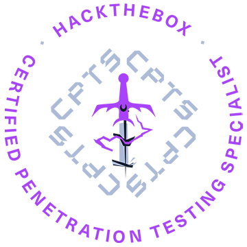

# Certified Penetration Testing Specialist (CPTS) - Study Material

	

## Introduction

This repository is dedicated to documenting my preparation for the HTB Certified Penetration Testing Specialist (CPTS) exam. It includes structured notes, methodology references, and practical walkthroughs aligned with the CPTS curriculum, combining both network and web application penetration testing topics.

The content is organized to cover the entire penetration testing lifecycle, from information gathering to exploitation, privilege escalation, and reporting. Core areas include:

- **Penetration Testing Methodology** – pre-engagement, scoping, rules of engagement, and reporting.
- **Network Security** – enumeration, service attacks, password attacks, pivoting, tunneling, and privilege escalation on Linux/Windows.
- **Active Directory Security** – enumeration, attacks, and common misconfigurations.
- **Web Application Security** – reconnaissance, fuzzing, SQL injection, XSS, file upload attacks, command injection, and other common web vulnerabilities.
- **Practical Skills Development** – hands-on exploitation, payload delivery, shells, file transfers, and the use of tools like Nmap, Hydra, SQLMap, Burp Suite, ZAP, Metasploit, and ffuf.

Each section contains technical notes, tool usage, and real-world inspired examples to build not just exam readiness but also a practical penetration testing mindset applicable in professional engagements.

Whether you are preparing for the CPTS certification or looking to strengthen your skills in network and web penetration testing, this repository serves as a study guide and technical reference for offensive security practitioners.

## Learning Path Topics

### 01 Penetration Testing Process

This module teaches the penetration testing process broken down into each stage and discussed in detail. We will cover many aspects of the role of a penetration tester during a penetration test, explained and illustrated with detailed examples. The module also covers pre-engagement steps like the criteria for establishing a contract with a client for a penetration testing engagement.

### 02 Getting Started

This module covers the fundamentals of penetration testing and an introduction to Hack The Box.

### 03 Network Enumeration with Nmap

Nmap is one of the most used networking mapping and discovery tools because of its accurate results and efficiency. The tool is widely used by both offensive and defensive security practitioners. This module covers fundamentals that will be needed to use the Nmap tool for performing effective network enumeration.

### 04 [Footprinting](./footprinting_skills_assessment.md)

This module covers techniques for footprinting the most commonly used services in almost all enterprise and business IT infrastructures. Footprinting is an essential phase of any penetration test or security audit to identify and prevent information disclosure. Using this process, we examine the individual services and attempt to obtain as much information from them as possible.

### 05 [Information Gathering - Web Edition](https://github.com/francescolonardo/CBBH-Preparation/blob/main/04_information_gathering_web_edition.md)

This module equips learners with essential web reconnaissance skills, crucial for ethical hacking and penetration testing. It explores both active and passive techniques, including DNS enumeration, web crawling, analysis of web archives and HTTP headers, and fingerprinting web technologies.

### 06 Vulnerability Assessment

This module introduces the concept of Vulnerability Assessments. We will review the differences between vulnerability assessments and penetration tests, how to carry out a vulnerability assessment, how to interpret the assessment results, and how to deliver an effective vulnerability assessment report.

### 07 File Transfers

During an assessment, it is very common for us to transfer files to and from a target system. This module covers file transfer techniques leveraging tools commonly available across all versions of Windows and Linux systems.

### 08 [Shells and Payloads](./shells_and_payloads_skills_assessment.md)

Gain the knowledge and skills to identify and use shells and payloads to establish a foothold on vulnerable Windows and Linux systems. This module utilizes a fictitious scenario where the learner will place themselves in the perspective of a sysadmin trying out for a position on CAT5 Security's network penetration testing team.

### 09 Using the Metasploit Framework

The Metasploit Framework is an open-source set of tools used for network enumeration, attacks, testing security vulnerabilities, evading detection, performing privilege escalation attacks, and performing post-exploitation.

### 10 [Password Attacks](./password_attacks_skills_assessment.md)

Passwords are still the primary method of authentication in corporate networks. If strong password policies are not enforced, users often choose weak, easy-to-remember passwords that can be cracked offline and leveraged to escalate access. As penetration testers, we encounter passwords in many forms during our assessments. It's essential to understand how passwords are stored, how they can be retrieved, methods for cracking weak passwords, techniques for using hashes that cannot be cracked, and how to identify weak or default password usage.

### 11 [Attacking Common Services](./attacking_common_services_skills_assessment.md)

Organizations regularly use a standard set of services for different purposes. It is vital to conduct penetration testing activities on each service internally and externally to ensure that they are not introducing security threats. This module will cover how to enumerate each service and test it against known vulnerabilities and exploits with a standard set of tools.

### 12 [Pivoting, Tunneling, and Port Forwarding](./pivoting_tunneling_and_port_forwarding_skills_assessment.md)

Once a foothold is gained during an assessment, it may be in scope to move laterally and vertically within a target network. Using one compromised machine to access another is called pivoting and allows us to access networks and resources that are not directly accessible to us through the compromised host. Port forwarding accepts the traffic on a given IP address and port and redirects it to a different IP address and port combination. Tunneling is a technique that allows us to encapsulate traffic within another protocol so that it looks like a benign traffic stream.

### 13 [Active Directory Enumeration and Attacks](./active_directory_enumeration_and_attacks_skills_assessment.md)

Active Directory (AD) is the leading enterprise domain management suite, providing identity and access management, centralized domain administration, authentication, and much more. Due to the many features and complexity of AD, it presents a large attack surface that is difficult to secure properly. To be successful as infosec professionals, we must understand AD architectures and how to secure our enterprise environments. As Penetration testers, having a firm grasp of what tools, techniques, and procedures are available to us for enumerating and attacking AD environments and commonly seen AD misconfigurations is a must.

### 14 [Using Web Proxies](https://github.com/francescolonardo/CBBH-Preparation/blob/main/03_using_web_proxies.md)

Web application penetration testing frameworks are an essential part of any web penetration test. This module will teach you two of the best frameworks: Burp Suite and OWASP ZAP.

### 15 [Attacking Web Applications with Ffuf](https://github.com/francescolonardo/CBBH-Preparation/blob/main/05_attacking_web_applications_with_ffuf.md)

This module covers the fundamental enumeration skills of web fuzzing and directory brute forcing using the Ffuf tool. The techniques learned in this module will help us in locating hidden pages, directories, and parameters when targeting web applications.

### 16 [Login Brute Forcing](https://github.com/francescolonardo/CBBH-Preparation/blob/main/13_login_brute_forcing.md)

The module contains an exploration of brute-forcing techniques, including the use of tools like Hydra and Medusa, and the importance of strong password practices. It covers various attack scenarios, such as targeting SSH, FTP, and web login forms.

### 17 [SQL Injection Fundamentals](https://github.com/francescolonardo/CBBH-Preparation/blob/main/08_sql_injection_fundamentals.md)

Databases are an important part of web application infrastructure and SQL (Structured Query Language) to store, retrieve, and manipulate information stored in them. SQL injection is a code injection technique used to take advantage of coding vulnerabilities and inject SQL queries via an application to bypass authentication, retrieve data from the back-end database, or achieve code execution on the underlying server.

### 18 [SQLMap Essentials](https://github.com/francescolonardo/CBBH-Preparation/blob/main/09_sqlmap_essentials.md)

The SQLMap Essentials module will teach you the basics of using SQLMap to discover various types of SQL Injection vulnerabilities, all the way to the advanced enumeration of databases to retrieve all data of interest.

### 19 [Cross-Site Scripting (XSS)](https://github.com/francescolonardo/CBBH-Preparation/blob/main/07_cross_site_scripting.md)

Cross-Site Scripting (XSS) vulnerabilities are among the most common web application vulnerabilities. An XSS vulnerability may allow an attacker to execute arbitrary JavaScript code within the target's browser and result in complete web application compromise if chained together with other vulnerabilities. This module will teach you how to identify XSS vulnerabilities and exploit them.

### 20 [File Inclusion](https://github.com/francescolonardo/CBBH-Preparation/blob/main/16_file_inclusion.md)

File Inclusion is a common web application vulnerability, which can be easily overlooked as part of a web application's functionality.

### 21 [File Upload Attacks](https://github.com/francescolonardo/CBBH-Preparation/blob/main/11_file_upload_attacks.md)

Arbitrary file uploads are among the most critical web vulnerabilities. These flaws enable attackers to upload malicious files, execute arbitrary commands on the back-end server, and even take control over the entire server and all web applications hosted on it and potentially gain access to sensitive data or cause a service disruption.

### 22 [Command Injections](https://github.com/francescolonardo/CBBH-Preparation/blob/main/10_command_injections.md)

Command injection vulnerabilities can be leveraged to compromise a hosting server and its entire network. This module will teach you how to identify and exploit command injection vulnerabilities and how to use various filter bypassing techniques to avoid security mitigations.

### 23 [Web Attacks](https://github.com/francescolonardo/CBBH-Preparation/blob/main/15_web_attacks.md)

This module covers three common web vulnerabilities, HTTP Verb Tampering, IDOR, and XXE, each of which can have a significant impact on a company's systems. We will cover how to identify, exploit, and prevent each of them through various methods.

### 24 [Attacking Common Applications](./attacking_common_applications_skills_assessment.md)

Penetration Testers can come across various applications, such as Content Management Systems, custom web applications, internal portals used by developers and sysadmins, and more. It's common to find the same applications across many different environments. While an application may not be vulnerable in one environment, it may be misconfigured or unpatched in the next. It is important as an assessor to have a firm grasp of enumerating and attacking the common applications discussed in this module. This knowledge will help when encountering other types of applications during assessments.

### 25 [Linux Privilege Escalation](./linux_privilege_escalation_skills_assessment.md)

Privilege escalation is a crucial phase during any security assessment. During this phase, we attempt to gain access to additional users, hosts, and resources to move closer to the assessment's overall goal. There are many ways to escalate privileges. This module aims to cover the most common methods emphasizing real-world misconfigurations and flaws that we may encounter in a client environment. The techniques covered in this module are not an exhaustive list of all possibilities and aim to avoid extreme "edge-case" tactics that may be seen in a Capture the Flag (CTF) exercise.

### 26 [Windows Privilege Escalation](./windows_privilege_escalation_skills_assessment.md)

After gaining a foothold, elevating our privileges will provide more options for persistence and may reveal information stored locally that can further our access in the environment. Enumeration is the key to privilege escalation. When you gain initial shell access to the host, it is important to gain situational awareness and uncover details relating to the OS version, patch level, any installed software, our current privileges, group memberships, and more. Windows presents an enormous attack surface and, being that most companies run Windows hosts in some way, we will more often than not find ourselves gaining access to Windows machines during our assessments. This covers common methods while emphasizing real-world misconfigurations and flaws that we may encounter during an assessment. There are many additional "edge-case" possibilities not covered in this module. We will cover both modern and legacy Windows Server and Desktop versions that may be present in a client environment.

### 27 Documentation and Reporting

Proper documentation is paramount during any engagement. The end goal of a technical assessment is the report deliverable which will often be presented to a broad audience within the target organization. We must take detailed notes and be very organized in our documentation, which will help us in the event of an incident during the assessment. This will also help ensure that our reports contain enough detail to illustrate the impact of our findings properly.

### 28 Attacking Enterprise Networks

#### 28.1 [Attacking Enterprise Networks - Internal Testing](./attacking_enterprise_networks_internal_testing.md)
#### 28.2 [Attacking Enterprise Networks - External Testing](./attacking_enterprise_networks_external_testing.md)
#### 28.3 [Attacking Enterprise Networks - Lateral Movement and Privilege Escalation](./attacking_enterprise_networks_lateral_movement_and_privilege_escalation.md)

We often encounter large and complex networks during our assessments. We must be comfortable approaching an internal or external network, regardless of the size, and be able to work through each phase of the penetration testing process to reach our goal. This module will guide students through a simulated penetration testing engagement, from start to finish, with an emphasis on hands-on testing steps that are directly applicable to real-world engagements.

---
---
